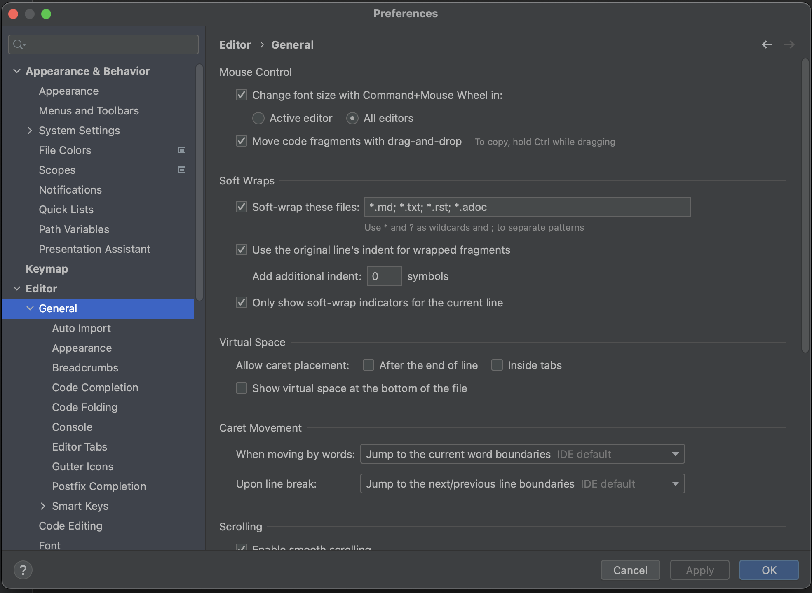

To enable mouse zoom, you need to turn it on explicitly. Go to **Preferences > Editor > General** and select **Change font size with Command+Mouse Wheel** (on Mac) or **Change font size with Control+Mouse** (on Windows/Linux). Click **OK** to apply the changes and close the dialog or click **Apply** to keep the dialog open.

Now we can use **Command+Mouse Wheel** (on Mac) or **Control+Mouse Wheel** (on Windows/Linux) to zoom in or out. While we are using mouse zoom, a popup appears containing the current font size on the left and a link to reset to the original font size on the right. Click the link to reset the font size.

