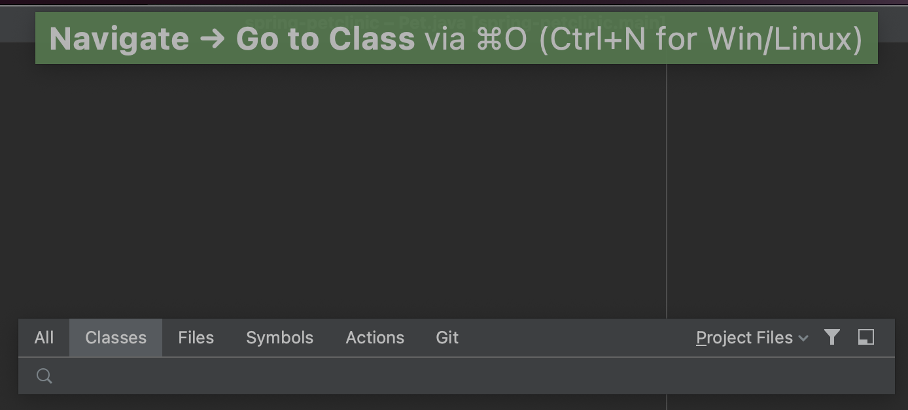
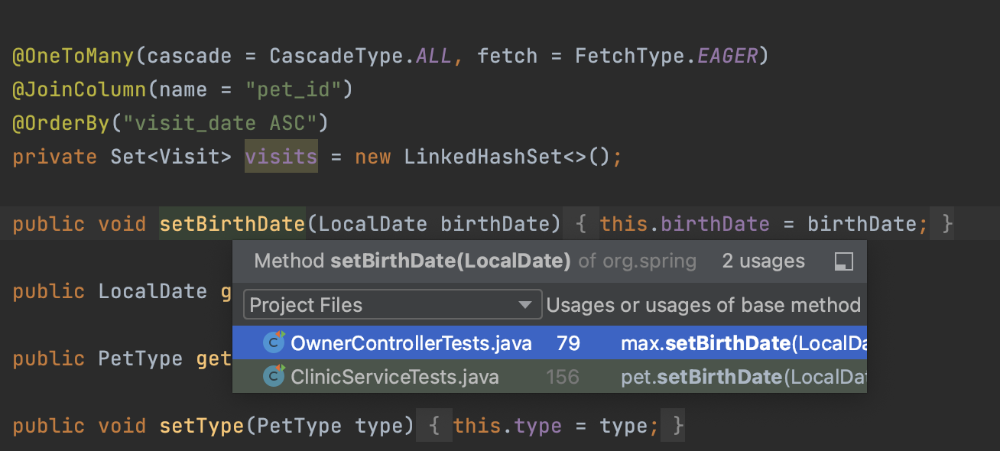
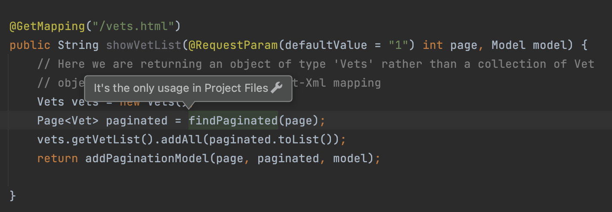
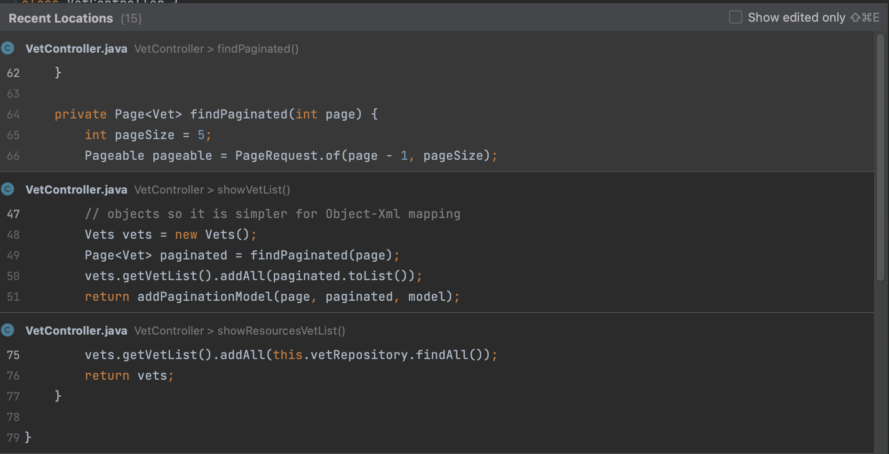
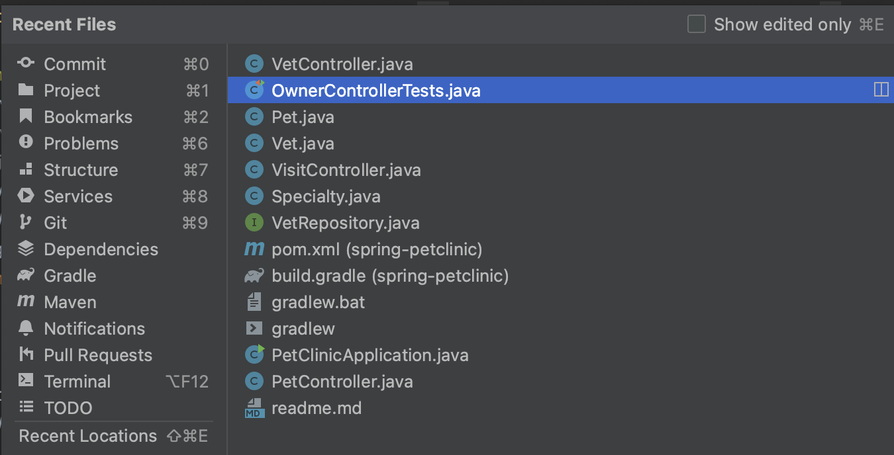

We can use several shortcuts to navigate around a project:

We can **Find a class** using **⌘ O** (on Mac) or **Ctrl+N** (on Windows/Linux).

We can move the caret to a method and use **⌘ B** (on Mac) or **Ctrl+B** (on Windows/Linux) to go to the declaration or usages. 

We can also navigate backwards by using **⌘ \[** (on Mac) or **Ctrl+Alt+Left** (on Windows/Linux), or navigate forward: **⌘ ]** (on Mac) or **Ctrl+Alt+Right** (on Windows/Linux).

Use **⇧ ⌘ E** (on Mac) or **Ctrl+Shift+E** (on Windows/Linux) to find **Recent Locations**.

Or find **Last edited location** with **⇧ ⌘ ⌫** (on Mac) or **Ctrl+Shift+Backspace** (on Windows/Linux).

Finally, we can find **Recent Files** using **⌘ E** (on Mac) or **Ctrl+E** (on Windows/Linux).

