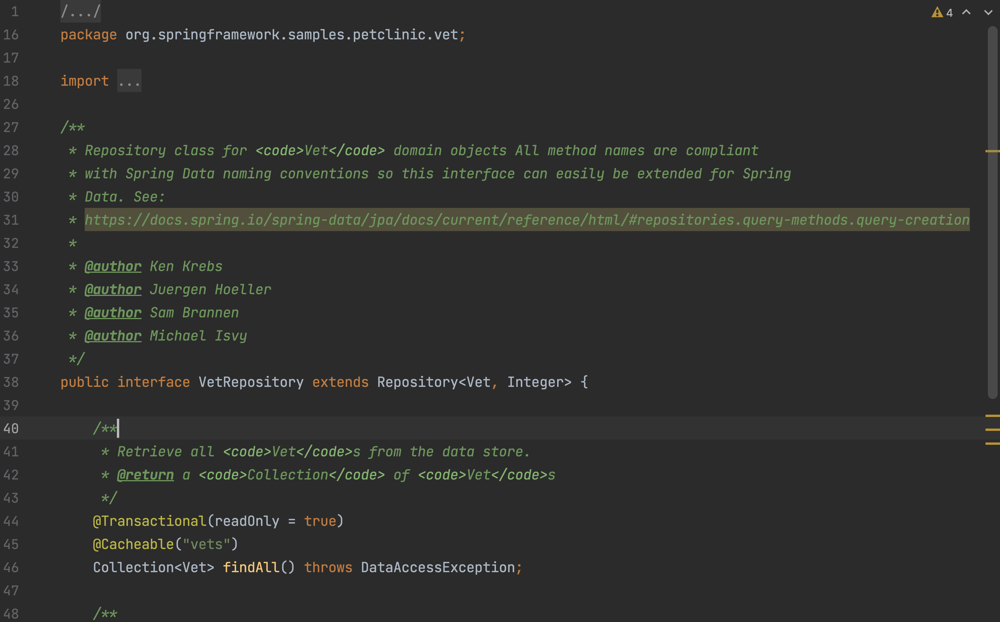
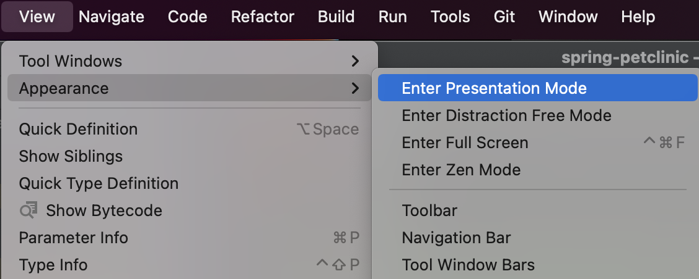
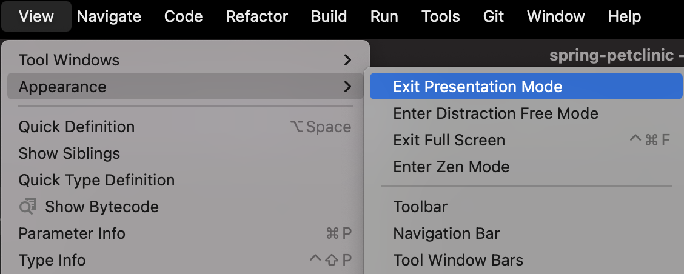
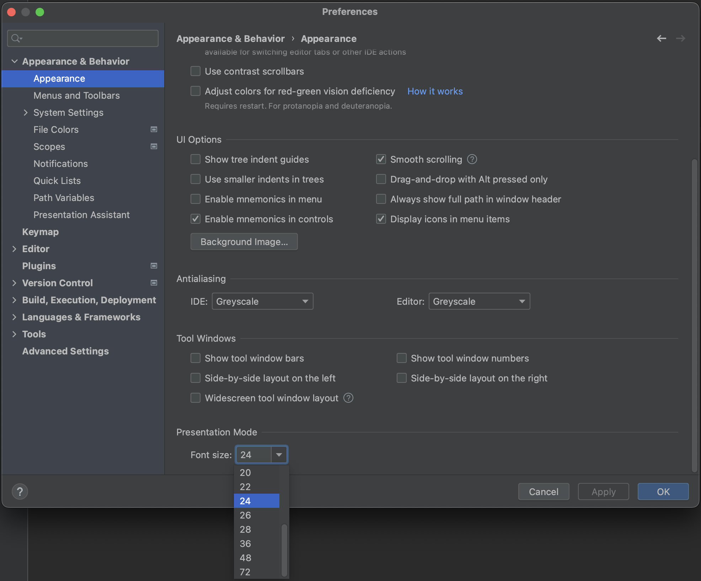
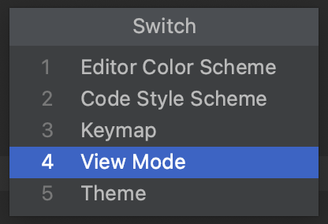
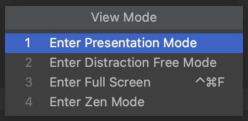
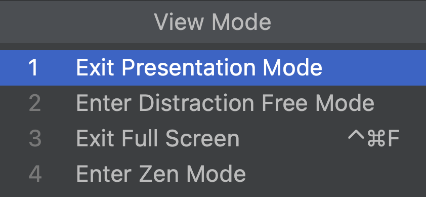

When presenting, you can use **Presentation Mode**. The IDE switches to full screen and everything is hidden except for the main editor window. The font size is increased, so it is easier to read from a distance. 

You can switch to Presentation Mode by clicking **View > Appearance > Enter Presentation Mode**.

**Exit Presentation Mode** by clicking **View > Appearance > Exit Presentation Mode**.

If needed, the font size in Presentation Mode can be configured in **Preferences > Appearance & Behavior > Appearance**. Scroll down to **Presentation Mode**, and font size and set the font size you want. Click **OK** to apply the changes and close the dialog or click **Apply** to keep the dialog open. Click **Cancel** to discard the changes and close the dialog.

We can also open Presentation Mode using short-cuts. Open the **Quick Switch Scheme** using **⌃\`** (on Mac) or **Ctrl+\`** (on Windows/Linux). Use the arrows to select **View Mode** and then select **Enter Presentation Mode**.

We can use **Quick Switch Scheme** again to **Exit Presentation Mode**.

