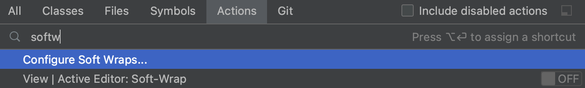
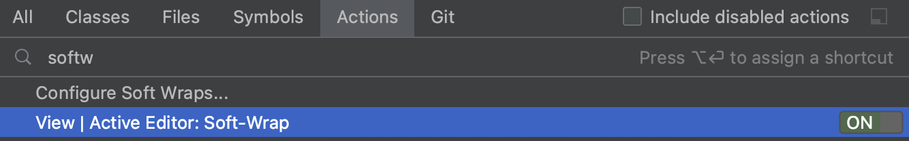
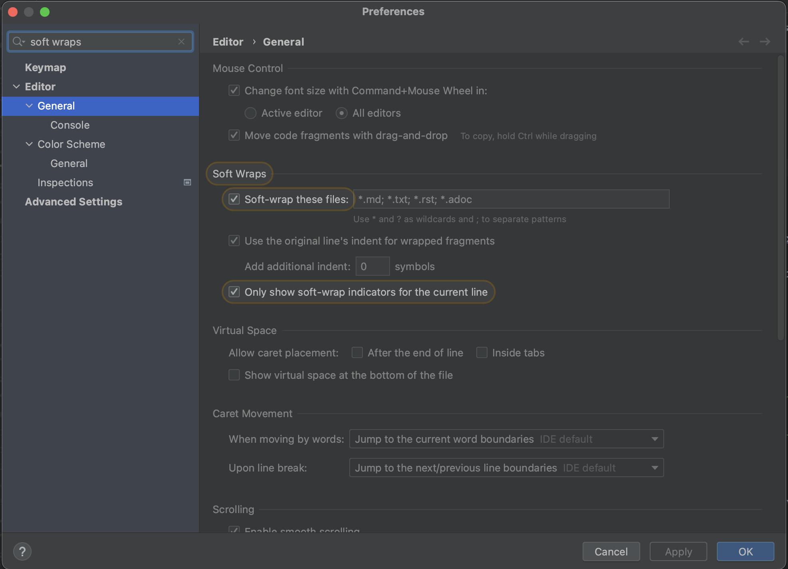

When using a file that has long lines, we can prevent horizontal scrolling by using soft-wrap. Let's use **Find Action** to enable soft-wrap. Press **⇧⌘A** (on Mac) or **Control+Shift+A** (on Windows/Linux) to open the Find Action dialog, and search for "soft-wrap".

We get the option to turn on soft-wrap, which will be for this file only. You can click this option to turn soft-wrap on or off. 

Alternatively, we can configure soft-wrap. Let's select "**Soft wrap these files**", which will soft-wrap several types of text files. Click **OK** to apply the changes and close the Preferences dialog.

