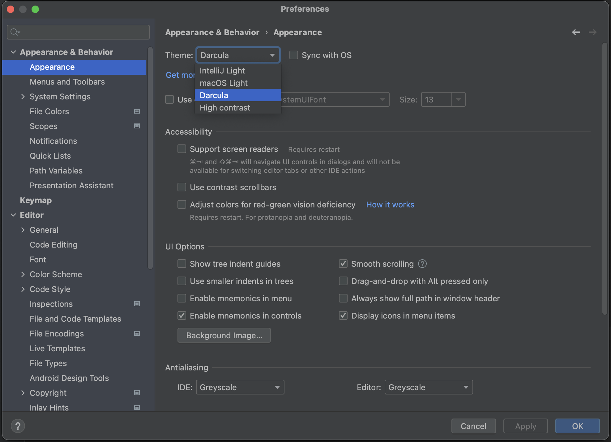

By default, IntelliJ IDEA uses the Darcula theme. To change it, go to **Preferences > Appearance & Behavior > Appearance**.

Select the UI theme from the Theme list:

* **IntelliJ Light** is a traditional light theme for IntelliJ-based IDEs
* **macOS Light** or **Windows 10 Light** is an OS-specific light theme available as a bundled plugin
* **Darcula** is the default dark theme that we're using here
* **High contrast** is a theme designed for users with color vision deficiency

Which theme to use depends on your personal preference. When presenting in front of an audience, you may want to take into account how light or dark the room is. If possible, try different themes and walk to the back of the room to see which one works best before your presentation. When sharing your screen during an online meeting, you may also want to check with teammates which theme works best.