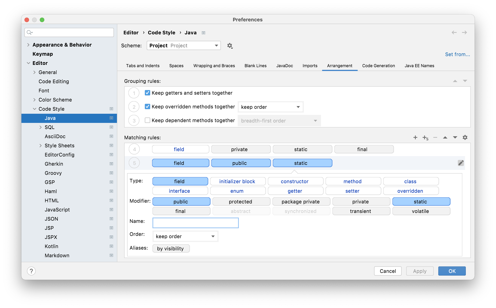

## A Before and After Example of Code Rearrangement
Let's take a look at an example with the following default arrangement:



Given you can't scroll a screenshot, here is the order in text form, so you can see what's happening:

|   |   |   |  | |  
| ----------- | ----------- | ----------- | ----------- | ----------- |
1 | field | public | static | final |
2 | field | protected | static | final | 
3| field | package private | static | final|
4| field | private | static | final|
5| field | public | static | |
6| field | protected | static | |
7| field | package private | static | |
8| field | private | static | |
9| initializer block | static | | |
10| field | public | final | |
11| field | protected | final | |
12| field | package private | final | |
13| field | private | final | |
14| field | public | | |
15| field | protected | | |
16| field | package private | | |
17| field | private | | |
18| field | | | |
19| initializer block | | | |
20| constructor | | | |
21| method | static | | |
22| method | | | |
23| method | name: get | | |
24| method | private | | |
25| enum | | | |
26| interface | | | |
27| class | static | | |
28| class | | | |

We will use this example code and then [invoke rearrange code](../invoking-rearranging-code).

```java
public class RearrangeCode {
    private int id;

    public int getId() {
        return id;
    }

    @Override
    public String toString() {
        return "RearrangeCode{" +
               "id=" + id +
               ", firstName='" + firstName + '\'' +
               ", middleName='" + middleName + '\'' +
               ", lastName='" + lastName + '\'' +
               ", phone='" + phone + '\'' +
               ", notes='" + notes + '\'' +
               ", ordersById=" + ordersById +
               '}';
    }

    private String firstName;

    private void privateHelperMethod() {
        // does something in here
    }

    public void setId(int id) {
        int newID = 1;
        System.out.println(newID);
        this.id = id;
    }

    private String middleName;

    public String getMiddleName() {
        return middleName;
    }

    public void setMiddleName(String middleName) {
        this.middleName = middleName;
    }

    private String lastName;

    public void setLastName(String lastName) {
        this.lastName = lastName;
    }

    private String phone;

    public String getPhone() {
        return phone;
    }

    public void setPhone(String phone) {
        this.phone = phone;
    }

    private String notes;

    public String getNotes() {
        return notes;
    }

    public void setNotes(String notes) {
        this.notes = notes;
    }

    @Override
    public boolean equals(Object o) {
        if (this == o) return true;
        if (o == null || getClass() != o.getClass()) return false;
        RearrangeCode that = (RearrangeCode) o;
        return id == that.id &&
               Objects.equals(firstName, that.firstName) &&
               Objects.equals(middleName, that.middleName) &&
               Objects.equals(lastName, that.lastName) &&
               Objects.equals(phone, that.phone) &&
               Objects.equals(notes, that.notes) &&
               Objects.equals(ordersById, that.ordersById);
    }

    @Override
    public int hashCode() {
        return Objects.hash(id, firstName, middleName, lastName, phone, notes, ordersById);
    }

    private Collection<Order> ordersById;

    public Collection<Order> getOrdersById() {
        return ordersById;
    }

    public void setOrdersById(Collection<Order> ordersById) {
        this.ordersById = ordersById;
    }
}

```

When you [Invoke Code Rearrangement](../invoking-rearranging-code) on this code either manually or on commit, the code will be rearranged (see below). Here is a list of changes:
- All the fields have moved to the top of the class because that's what we specified in our grouping rows 1-8.
- The getter and setter methods are grouped because IntelliJ IDEA has grouped them together from the grouping rules.
- The Override methods have been grouped together because we specified we wanted to keep them together in the grouping rules) and they are public so line 22 of our matching rules is applied. The Override methods are also implemented in the order they appear in the Object super class.
- Next are the remaining two public methods, which are obeying line 22 of our matching rules.
- Finally, there's the private method which is obeying line 24 of our matching rules.

```java
public class RearrangeCode {
    private int id;
    private String firstName;
    private String middleName;
    private String lastName;
    private String phone;
    private String notes;
    private Collection<Order> ordersById;

    public int getId() {
        return id;
    }

    public void setId(int id) {
        int newID = 1;
        System.out.println(newID);
        this.id = id;
    }

    public String getMiddleName() {
        return middleName;
    }

    public void setMiddleName(String middleName) {
        this.middleName = middleName;
    }

    public void setLastName(String lastName) {
        this.lastName = lastName;
    }

    public String getPhone() {
        return phone;
    }

    public void setPhone(String phone) {
        this.phone = phone;
    }

    public String getNotes() {
        return notes;
    }

    public void setNotes(String notes) {
        this.notes = notes;
    }

    @Override
    public int hashCode() {
        return Objects.hash(id, firstName, middleName, lastName, phone, notes, ordersById);
    }

    @Override
    public boolean equals(Object o) {
        if (this == o) return true;
        if (o == null || getClass() != o.getClass()) return false;
        RearrangeCode that = (RearrangeCode) o;
        return id == that.id &&
               Objects.equals(firstName, that.firstName) &&
               Objects.equals(middleName, that.middleName) &&
               Objects.equals(lastName, that.lastName) &&
               Objects.equals(phone, that.phone) &&
               Objects.equals(notes, that.notes) &&
               Objects.equals(ordersById, that.ordersById);
    }

    @Override
    public String toString() {
        return "RearrangeCode{" +
               "id=" + id +
               ", firstName='" + firstName + '\'' +
               ", middleName='" + middleName + '\'' +
               ", lastName='" + lastName + '\'' +
               ", phone='" + phone + '\'' +
               ", notes='" + notes + '\'' +
               ", ordersById=" + ordersById +
               '}';
    }

    public Collection<Order> getOrdersById() {
        return ordersById;
    }

    public void setOrdersById(Collection<Order> ordersById) {
        this.ordersById = ordersById;
    }

    private void privateHelperMethod() {
        // does something in here
    }
}


```
## Summary
Let's summarise everything we've learned in the final step of this tutorial.
