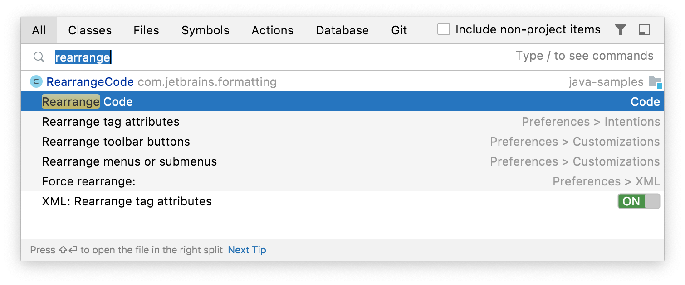
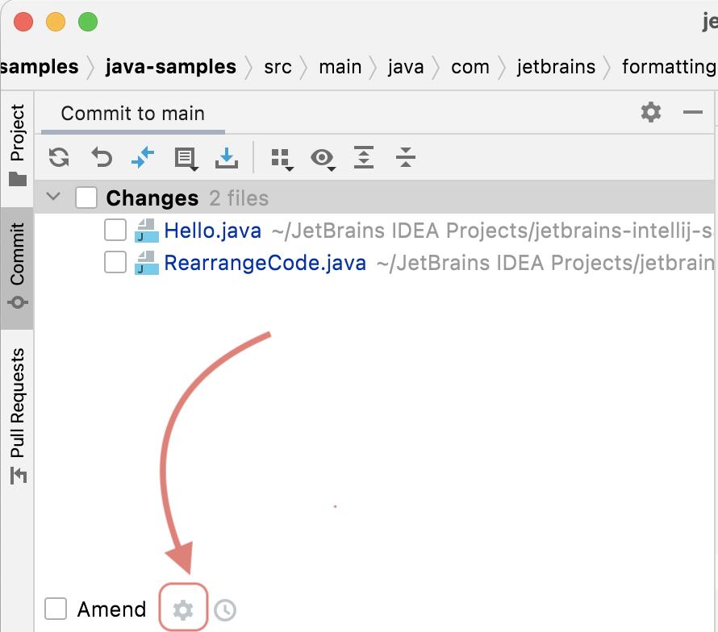
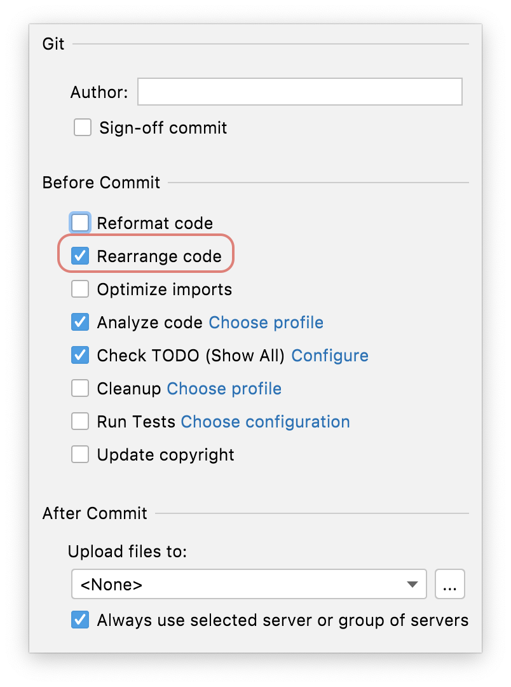
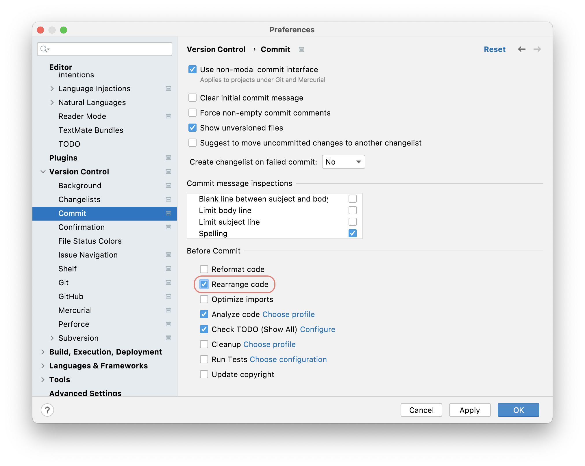

## When to Invoke Rearrange Code
Before we talk about _how_ to invoke rearrange code, it's worth mentioning when to invoke it. There are a couple of approaches here. Of course if you're working on a brand-new code base it's very simple to go with invoking it [when you commit](#on-commit) your code because it's new code. However, more often and more realistically, you'll be working on a code base where the standards that you, and your team, have agreed on have not been universally applied in the past.

Regardless of how you proceed, we strongly recommend that you only commit code that has been rearranged, not code that has been rearranged and changed. That is to say - commits should be _rearrange code_, or _change code_, not both. 

You might want to _scorch the earth_ and perform a series of commits on your entire code base to rearrange it as one team task and not make any other changes until the entire code base has been rearranged according to the rules you define. 

Alternatively, you might want to take a more gradual approach and just rearrange classes that you are making changes to. However, a word of warning here, we strongly recommend that you rearrange the class first in one separate commit and then go ahead and make your changes as stated earlier.     

## How to Invoke Rearranging Code
There are a few ways that you can invoke rearrange code. Let's take a look at each one in turn.

### Manually at a Class Level
You can invoke Rearrange Code manually on a class. This is a great way to get a feel for how your class(es) will look when you do rearrange code on a larger scale. If you're just learning about the settings and how best to apply them to your code base, then you can start here to get comfortable. However, it doesn't scale so it's for playing around only!

To invoke Rearrange Code in a class, use **⌘⇧A** (macOS), or **Ctrl+Shift+A** (Windows/Linux), to bring up the Find Actions dialog and then type in _Rearrange Code_:

This will give you a feel for how the [Rearrange Code Settings](../rearranging-code-settings) will apply to your project on a larger scale. 

### On Commit at a Class Level
You can get IntelliJ IDEA to rearrange your code when you commit it which is often the preferred way of working depending on your agreements and approach for when you're going to rearrange the code. 

You can rearrange code on commit on a per-class basis with the cog in the Commit Tool Window which is invoked with **⌘0** (macOS),  or **Ctrl+0** (Windows/Linux):

When you click the cog you can select the check box adjacent to Rearrange Code:

This will rearrange your code in that class according to your settings when you commit it. 

### On Commit at a Project Level
If you always want to rearrange code at a project level when you commit it, you can use **⌘,** (macOS), **Ctrl+Alt+S** (Windows/Linux) to display the Preferences/Settings and then search for _on commit_. The option you want is **Version Control > Commit** and then the **Before Commit** panel. 

Select the check box adjacent to the **Rearrange Code** to always rearrange your files prior to commit. This will apply to all your languages. 

## A Worked Example for Rearrange Code
So now you know _when_ and _how_ to invoke rearrange code. Let's take a look at a worked example in the next step of this tutorial.