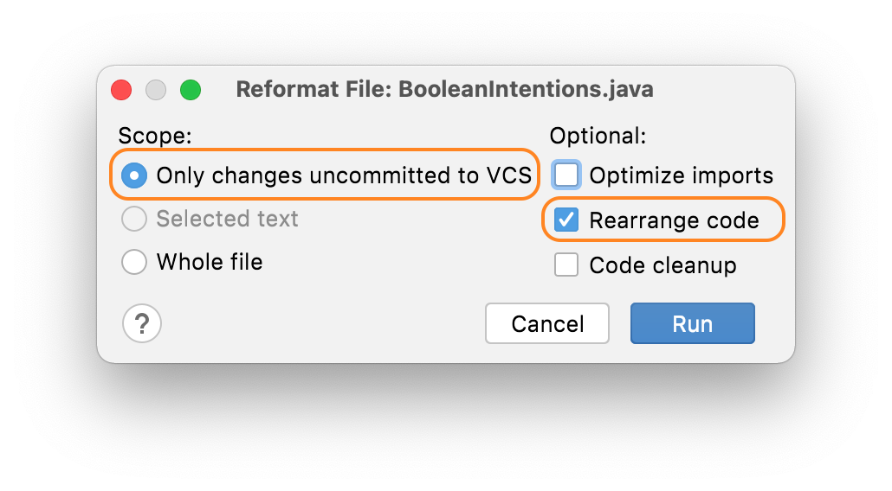
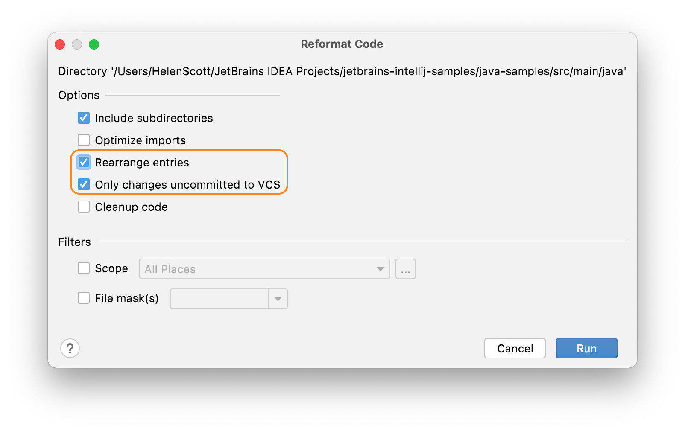

## When to Invoke Rearrange Code
Before we talk about _how_ to invoke rearrange code, it's worth mentioning _when_ to invoke it. There are a couple of approaches here. Of course, if you're working on a brand-new codebase it's very simple to go with invoking it before you commit your code because it's all net-new code. You can find this option in the [Before Commit settings](https://www.jetbrains.com/help/idea/commit-changes-dialog.html#before_commit). 

However, more often and more realistically, you'll be working on a code base where the standards that you, and your team, have agreed on have not been universally applied in the past, and you probably only want to rearrange code on a case by case basis. This is the use case we'll look at in this section.

We recommend that you keep commits separate so that you have one commit for rearranging code and one or more where you have changed code. This helps to make the file history more readable. 

## How to Invoke Rearranging Code
If you want to rearrange code in a whole class, you can invoke [rearrange code](https://www.jetbrains.com/help/idea/reformat-and-rearrange-code.html#arrange_code) manually. 

To invoke Rearrange Code in a class, use **⌘⇧A** (macOS), or **Ctrl+Shift+A** (Windows/Linux), to bring up the Find Actions dialog and then type in _Rearrange Code_:

Press **Enter** on **Rearrange Code** option to apply the settings to the whole class. Be aware that this will rearrange the whole file, irrespective of what you changed. 

Fortunately, IntelliJ IDEA also allows you to choose to rearrange **only** code that you've changed. 

### Rearranging Only Code You've Changed 
Often you don’t want to rearrange the whole file that you’re working on, particularly if this is a code base with inconsistent code arrangement. You don't want to commit a lot of white space changes as well as the feature or bug fix that you've done.

If you are working in a file with some inconsistently arranged code, but you’ve only changed a small part of it, using **Rearrange Code** might change parts of the file you haven't touched. In this instance, you would ideally like to highlight the code you’ve changed and just rearrange that, but that won’t work when your changes are scattered throughout the file.

Instead, you can use **⌥⇧⌘L** (macOS), or **Ctrl+Alt+Shift+L** (Windows/Linux) to bring up the reformatting options dialog for that file:

In this dialog, select **Only changes uncommitted to VCS** and select the **Rearrange entries** checkbox. When you press **Run**, IntelliJ IDEA will [reformat](https://www.jetbrains.com/help/idea/reformat-file-dialog.html) (according to your reformat settings) **and** rearrange the lines in the file that you've changed.

You can also use **⌥⌘L** (macOS), or **Ctrl+Alt+L** in the Project Window **⌘N** (macOS), or **Alt+Insert** (Windows/Linux) to bring up the Reformat Code dialog. You can then select the **Only changes uncommitted to VCS** and **Rearrange Code** checkboxes to get IntelliJ IDEA to do this action at a higher level.

## Other Code Style Settings
We have a separate tutorial on reformatting your code which is included in the Code Style settings, so you can check that out if it interests you in the [tutorials section](https://www.jetbrains.com/idea/guide/tutorials/).

## A Worked Example for Rearrange Code
So now you know _when_ and _how_ to invoke rearrange code. Let's take a look at a worked example in the next step of this tutorial.