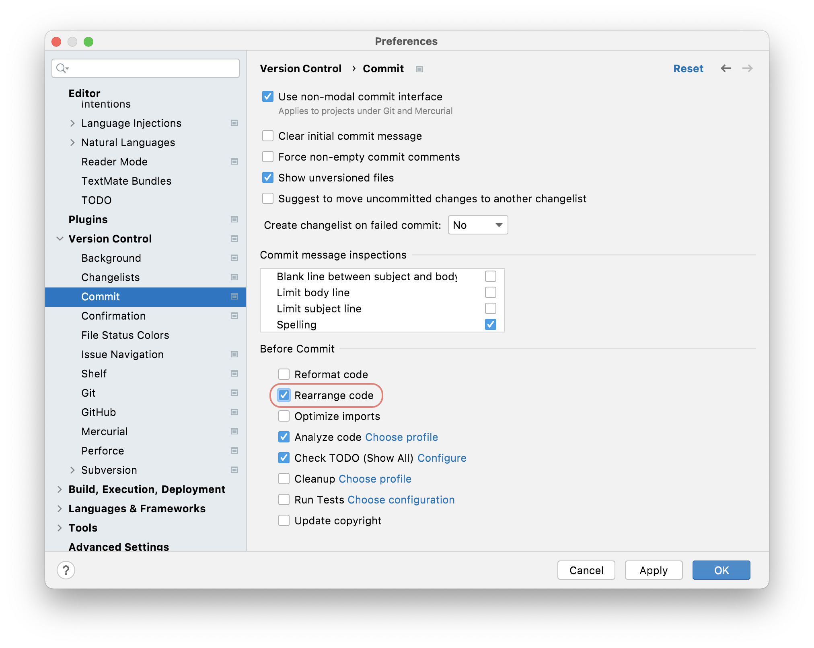

## When to Invoke Rearrange Code
Before we talk about _how_ to invoke rearrange code, it's worth mentioning _when_ to invoke it. There are a couple of approaches here. Of course, if you're working on a brand-new codebase it's very simple to go with invoking it before you commit your code because it's all net-new code. We will talk about this option in this section. However, more often and more realistically, you'll be working on a code base where the standards that you, and your team, have agreed on have not been universally applied in the past.

Regardless of how you proceed, we strongly recommend that you only commit code that has been rearranged, not code that has been rearranged and changed. That is to say - commits should be _rearrange code_, or _change code_, not both. 

For example, you might want to _scorch the earth_ and perform a series of commits on your entire code base to rearrange it as one team task and not make any other changes until the entire code base has been rearranged according to the rules you've agreed on. 

Alternatively, you might want to take a more gradual approach and just rearrange classes that you are making changes to. You might also want to just rearrange code that you've added or changed and leave the rest of the class untouched. IntelliJ IDEA supports all these options, let's take a look at them. 

## How to Invoke Rearranging Code
Here are two ways that you can invoke rearrange code (and only rearrange code) in addition to what we've discussed:
- [Manually at a Class Level](#manually-at-a-class-level) 
- [Rearrange Code Before Commit](#rearrange-code-before-commit)

### Manually at a Class Level
You can invoke [rearrange code](https://www.jetbrains.com/help/idea/reformat-and-rearrange-code.html#arrange_code) manually on a class. This is a great way to get a feel for how your class(es) will look when you do rearrange code on a larger scale. If you're just learning about the settings and how best to apply them to your code base, then you can start here to get comfortable. However, it doesn't scale. so it's best for playing around only!

To invoke Rearrange Code in a class, use **⌘⇧A** (macOS), or **Ctrl+Shift+A** (Windows/Linux), to bring up the Find Actions dialog and then type in _Rearrange Code_:

Press **Enter** on **Rearrange Code** option to apply the settings to your class. This will give you a feel for how the [Rearrange Code Settings](../rearranging-code-settings) will apply to your project on a larger scale. 

### Rearrange Code Before Commit
If you always want to rearrange code in this Project before you commit it, you can do this in one of two ways. You can either use **⌘,** (macOS), **Ctrl+Alt+S** (Windows/Linux) to display the Preferences/Settings and then search for _on commit_. The option you want is **Version Control > Commit** and then the **Before Commit** panel. 

Select the **Rearrange Code** checkbox and press **OK** to always rearrange your files prior to commit. This will apply to all your languages. 

Alternatively, you can use the cog in the Commit Tool Window which is invoked with **⌘0** (macOS), or **Ctrl+0** (Windows/Linux):

When you click the cog you can select the **Rearrange** Code checkbox you'll see this dialog:

Select the **Rearrange Code** checkbox and press **OK** to always rearrange your files prior to commit. This will apply to all your languages from your next commit. 

## A Worked Example for Rearrange Code
So now you know _when_ and _how_ to invoke rearrange code. Let's take a look at a worked example in the next step of this tutorial.