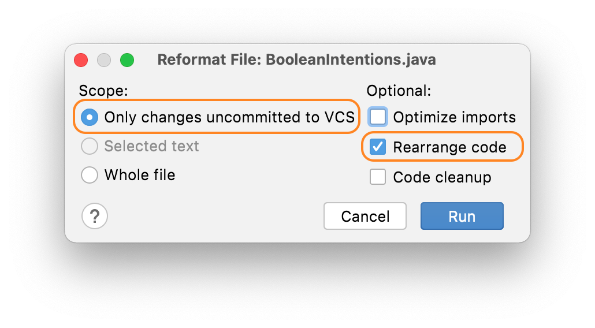
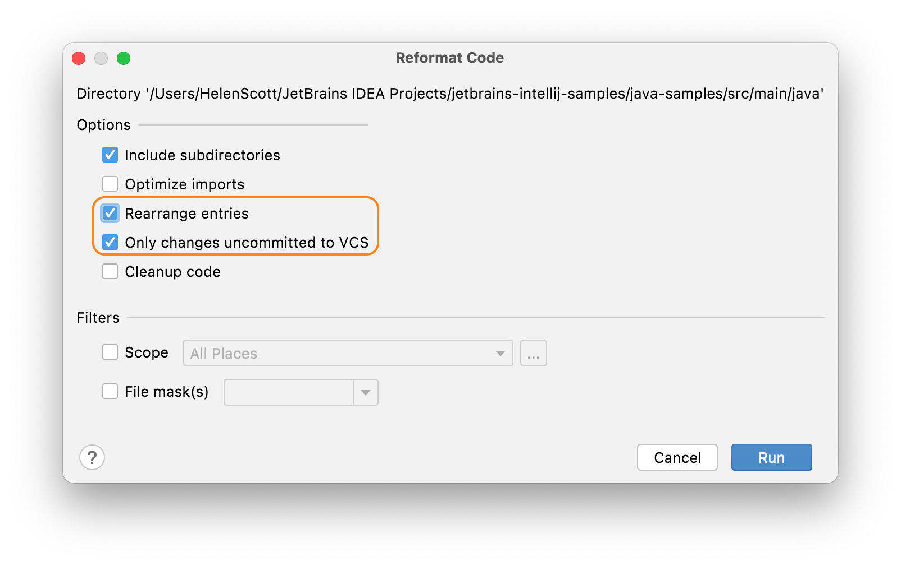

## Rearranging Only Code You've Changed
Often you'll be working on a code base where the standards that you, and your team, have agreed on have not been universally applied in the past, and you probably only want to rearrange code on a case by case basis. This is the use case we'll look at in this section.

If you are working in a file with some inconsistently arranged code, but you’ve only changed a small part of it, using **Rearrange Code** might change parts of the file you haven't touched. In this instance, you would ideally like to highlight the code you’ve changed and just rearrange that, but that won’t work when your changes are scattered throughout the file.

Instead, you can use **⌥⇧⌘L** (macOS), or **Ctrl+Alt+Shift+L** (Windows/Linux) to bring up the reformatting options dialog for that file:

In this dialog, select **Only changes uncommitted to VCS** and select the **Rearrange entries** checkbox. When you press **Run**, IntelliJ IDEA will [reformat](https://www.jetbrains.com/help/idea/reformat-file-dialog.html) (according to your reformat settings) **and** rearrange only the lines in the file that you've changed.

You can also use **⌥⌘L** (macOS), or **Ctrl+Alt+L** in the Project Window **⌘N** (macOS), or **Alt+Insert** (Windows/Linux) to bring up the Reformat Code dialog. You can then select the **Only changes uncommitted to VCS** and **Rearrange Code** checkboxes to get IntelliJ IDEA to perform this action at a higher level.

## Summary
We've looked at moving statements and lines around, a worked example and how to rearrange just the code that you've changed in this tutorial. In the next step we'll summarise everything including the shortcuts we've used. 