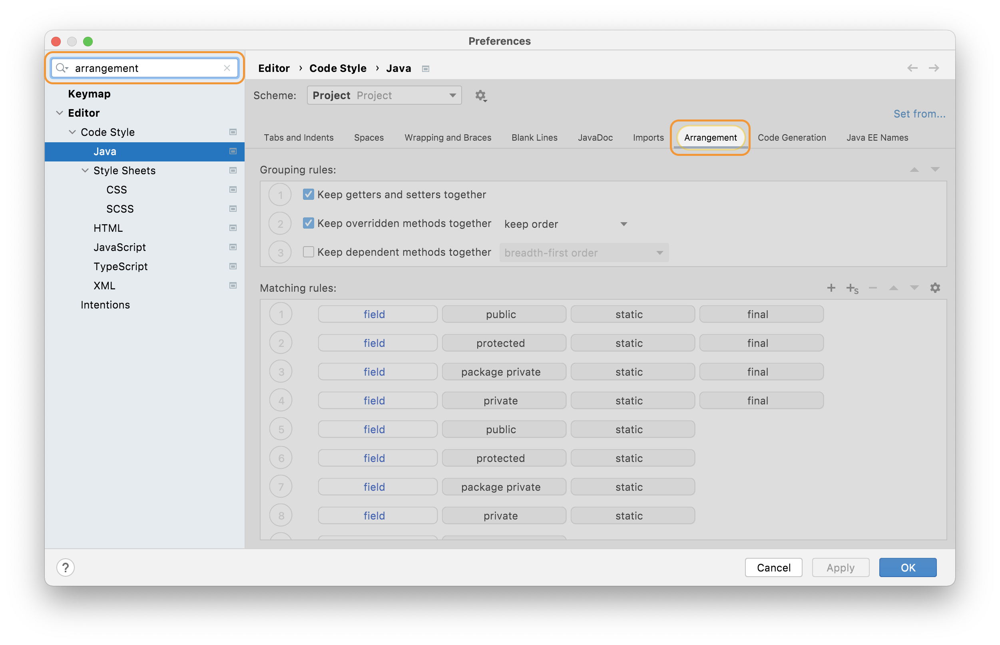
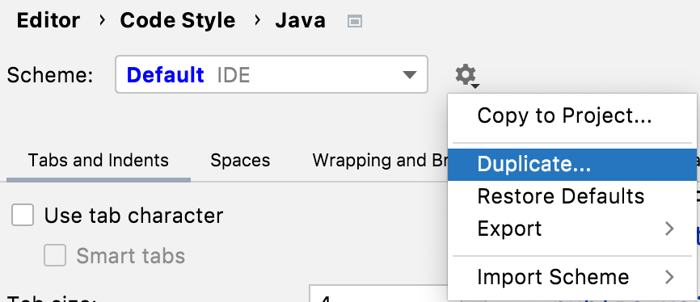

## Where and How to Change Settings for Rearrange Code 
IntelliJ IDEA can define the arrangement of your classes in the code style settings. Let's take a look at the settings first, before we look at how we can invoke rearrange code in the next step. 

### Arrangement Settings/Preferences
To change your code arrangement settings, use **⌘,** (macOS), **Ctrl+Shift+S** (Windows/Linux), to bring up the Preferences/Settings dialog. This dialog is searchable, so you can type in _arrangement_. This filters the dialog to **Code Style**. You can then select the language you're working with. In this tutorial we will use **Java**. Alternatively, you can navigate to **Editor > Code Style > Java**.

Before you go diving in and changing settings, be aware that these settings are defined at the project and IDE level. You can only have one Project scheme, and it's applied to your current project. If you want to change it, you need to first select the Default IDE scheme, then press the cog to the right of the drop-down and select Duplicate. You can subsequently copy this new scheme to your project if you want to.

Navigate to the **Arrangement **tab in this view. It is grouped into two areas:
- [Grouping Rules](#grouping-rules)
- [Matching Rules](#matching-rules)

As a side note, if you do make some changes here, and you want to reset them without resetting all the settings, you can click the blue **Reset** link on the top-right of this dialog. It will only be shown when you've made a change to your settings.

#### Grouping Rules
These rules allow you to group these three code elements:

**Getters and Setters** is fairly self-explanatory. When this checkbox is selected, and you invoke rearrange code, your getters and setters will be grouped together in your class. 

**Override methods** is similar to Getters and Setters in that it will group your Override methods together in your class. You also have the option to order them by the order they are defined in the super class or interface, or to order them by name.  

**Dependent methods** has a drop-down that allows you to select breadth-first or depth-first for method coupling. You may have a user-case for this option, but for most Java code bases that have evolved over time, trying to keep _related_ methods together is not usually what you want to do. If you do choose to use this option then it will take priority over Matching Rules. We suggest you use this option or Matching Rules, not both. In our example we're not going to select this option. Instead, we're going to use Matching Rules defined in the next section as this is a more common real-world scenario.

#### Matching Rules
This is where you can define how you'd like your classes to be ordered when you invoke rearrange code. You can select any line and move it up or down as required with the arrows in the top-right. You can also click the pencil icon to the right of each row to alter the rule and select a finer level of granularity. We're going to take a look at [an example](../example-of-rearranging-code) of how the default rules would be applied to some code later in this tutorial. 

## Other Code Style Settings
We have a separate tutorial on reformatting your code which is included in the Code Style settings, so you can check that out if it interests you in the [tutorials section](https://www.jetbrains.com/idea/guide/tutorials/).

## Invoking Rearrange Code
Now you've defined what your grouping rules and matching rules are, you need to consider when and how to invoke them. We'll take a look at this in the next step of this tutorial.