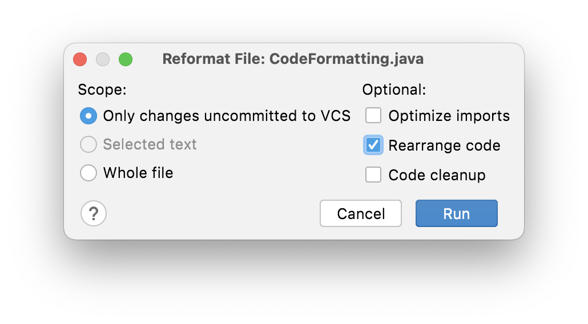
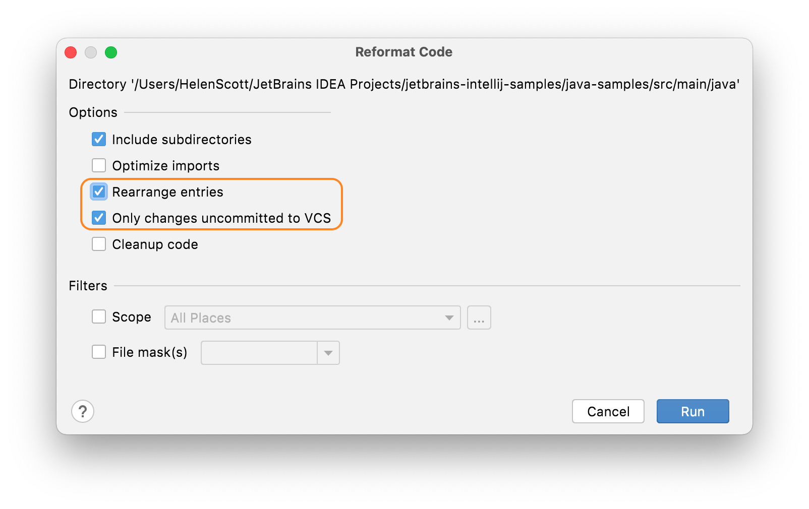

## Rearranging Only Code You Have Changed in One File
Often you don’t want to rearrange the whole file(s) that you’re working on, particularly if this is a code base with inconsistent code arrangement. You don't want to commit a lot of white space changes as well as the feature or bug fix that you've done. 

For this part, you need to understanding that rearranging code is part of reformatting code. While you can rearrange code at a class level independently of other reformatting options, you can use the Reformatting dialog to rearrange (and reformat) code at a higher level of your project hierarchy.  

If you are working in a file with some inconsistently arranged code, but you’ve only changed a small part of it, using **Rearrange Code** might change parts of the file you haven't touched. In this instance, you would ideally like to highlight the code you’ve changed and just rearrange that, but that won’t work when your changes are scattered throughout the file.

Instead, you can use **⌥⇧⌘L** (macOS), or **Ctrl+Alt+Shift+L** (Windows/Linux) to bring up the reformatting options dialog for that file:

In this dialog, select **Only changes uncommitted to VCS** and select the **Rearrange Code** checkbox. When you press **Run**, IntelliJ IDEA will [reformat](https://www.jetbrains.com/help/idea/reformat-file-dialog.html) (according to your reformat settings) **and** rearrange the lines in the file that you've changed and nothing else.

## Rearranging Only Code You Have Changed at a Directory Level
To scale this solution up from one file, you need to go to the Project Window **⌘1** (macOS), or **Alt+1** (Windows/Linux) and then use the same shortcut without the **Shift** key, so **⌥⌘L** (macOS), or **Ctrl+Alt+L** (Windows/Linux) to bring up the reformatting options dialog for the code in your project:

In this dialog, select **Only changes uncommitted to VCS** and select the **Rearrange entries** checkbox. This will reformat and rearrange the code in that directory (and subdirectories if you selected to include them).

## Other Code Style Settings
We have a separate tutorial on reformatting your code which is included in the Code Style settings, so you can check that out if it interests you in the [tutorials section](https://www.jetbrains.com/idea/guide/tutorials/).

## Invoking Rearrange Code
Now you've defined what your grouping rules and matching rules are, you need to consider when and how to invoke them. We'll take a look at this in the next step of this tutorial.