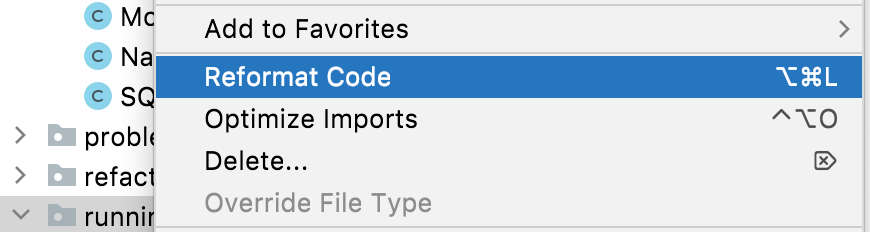

## When to Invoke Reformat Code
Before we talk about _how_ to invoke reformat code, it's worth mentioning when to invoke it. There are a couple of approaches here. Of course, if you're working on a brand-new code base it's very simple to go with invoking it when you commit your code because it's all net-new code. However, more often and more realistically, you'll be working on a code base where the standards that you, and your team, have agreed on have not been universally applied in the past.

Regardless of how you proceed, we strongly recommend that you only commit code that has been reformatted, not code that has been reformatted and changed. That is to say - commits should be reformat code, or change code, not both.

You might want to scorch the earth and perform a series of commits on your entire code base to reformat it as one team task and not make any other changes until the entire code base has been reformatted according to the rules you've agreed on.

Alternatively, you might want to take a more gradual approach and just reformat classes that you are making changes to. However, a word of warning here, we strongly recommend that you reformat the class first in one separate commit and then go ahead and make your changes as stated earlier - reformat code, or changes, not both!

## How to Invoke Reformatting Code

There are a few ways that you can invoke reformat code. Let's take a look at each one in turn.

### Manually at a Class Level
We've already looked at this in an [earlier step of the tutorial](../reformatting-a-selection-or-class) with the keyboard shortcut **⌘⌥L** (macOS), or **Ctrl+Alt+L** (Windows/Linux). However, you can also invoke it at a class level with ⌘⇧A (macOS), or Ctrl+Shift+A (Windows/Linux), to bring up the Find Actions dialog and then type in _Reformat Code_:

Press **Enter** on the **Reformat Code** option to apply the settings to your class. This will give you a feel for how the Reformat Code Settings will apply to your project on a larger scale.

### Reformatting Only Code You Have Changed
Often you don’t want to reformat the whole file that you’re working on, particularly if this is a code base with inconsistent formatting. You don't want to commit a lot of white space changes as well as the feature or bug fix that you've done.  If you are working on a file with some inconsistently formatted code, but you’ve only changed a small part of it, using **Reformat Code** might change parts of the file you haven't touched. In this instance, you would ideally like to highlight the code you’ve changed and [just reformat that](../reformatting-a-selection-or-class), but that won’t work when your changes are scattered throughout the file.

Instead, you can use **⌥⇧⌘L** (macOS), or **Ctrl+Alt+Shift+L** (Windows/Linux) to bring up the reformatting options dialog:

In this dialog, select **Only changes uncommitted to VCS**. When you press **Run**, IntelliJ IDEA will reformat the lines in the file that you've changed and nothing else. 

### Reformat Code Per Commit

You can get IntelliJ IDEA to reformat your code before you commit it which may be a half-way house for your team if you have a mix of new and old code. 

You can reformat your code in the classes you are about to commit with the cog in the Commit Tool Window which is invoked with ⌘0 (macOS), or Ctrl+0 (Windows/Linux):

When you click the cog you can select the checkbox adjacent to Reformat Code:

This will reformat your code in those classes when you commit them according to your settings you've defined.

### Before Commit at Project Level 

If you always want to rearrange code at a project level before you commit it, you can use **⌘,** (macOS), **Ctrl+Alt+S** (Windows/Linux) to display the Preferences/Settings and then search for _on commit_. The option you want is **Version Control > Commit** and then the **Before Commit** panel.

Select the checkbox adjacent to the **Reformat Code** check box and press **OK** to always reformat your files prior to commit. This will apply to all your languages.

This will reformat your code in those classes when you commit them according to your settings you've defined.

### Reformatting a Whole Directory
Alternatively, you can [reformat a specific directory](https://www.jetbrains.com/help/idea/reformat-and-rearrange-code.html#reformat_module_directory). This option is really useful if you're reformatting a larger project in stages. You can perform the reformat at directory with **⌘1** (macOS), or ****Alt+1** (Windows/Linux) to display the Project Window and then right-click on the directory you want to reformat. From the context menu you can press the **Reformat Code** option to reformat all the code in that directory:

When you press **Enter** you will see the **Reformat dialog**. You can make any additional changes here, such as selecting **Only changes uncommitted to VCS** if you want to.

## Excluding Code from Reformatting
It's worth mentioning here that you can also [exclude files from reformatting](https://www.jetbrains.com/help/idea/reformat-and-rearrange-code.html#exclude_file_from_reformat) if you want to.
Why you might want to do that and how to (again) manage it if it's just your changes if required. 

## Next step