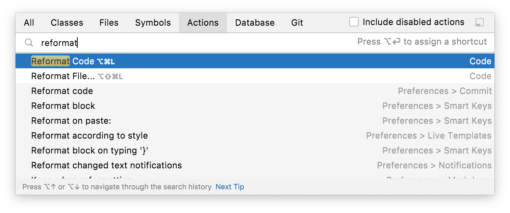
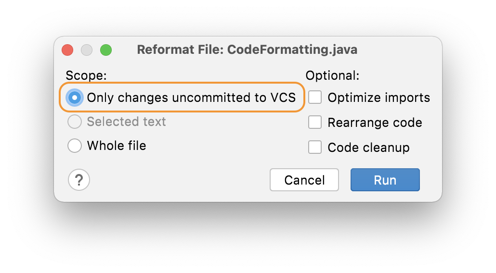
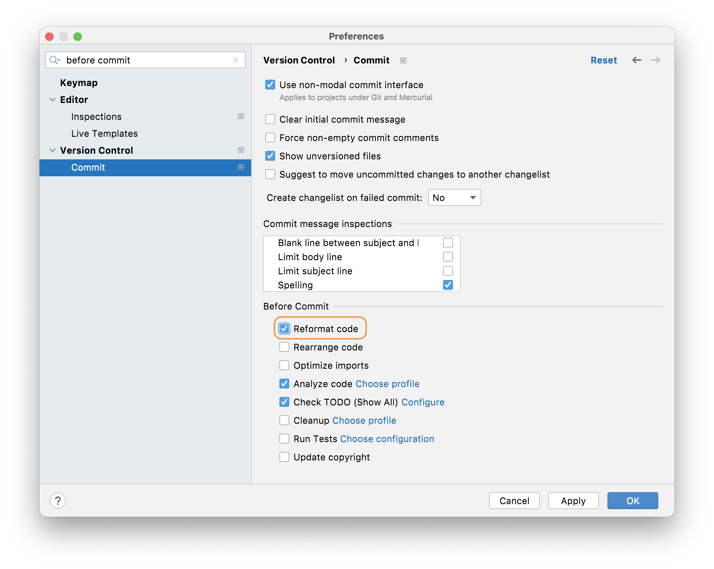
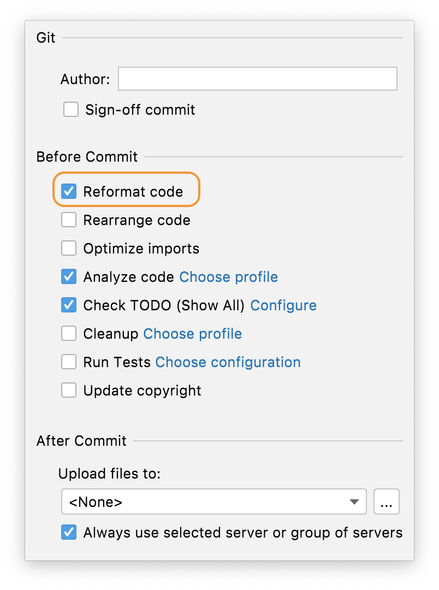

## When to Invoke Reformat Code
Before we talk about _how_ to invoke reformat code, it's worth mentioning when to invoke it. There are a couple of approaches here. Of course, if you're working on a brand-new code base it's very simple to go with invoking it when you commit your code because it's all net-new code, we will talk about that option here. 

However, more often and more realistically, you'll be working on a code base where the standards that you, and your team, have agreed on have not been universally applied in the past, and you probably only want to reformat code on a case by case basis. 

We recommend that you keep commits separate so that you have one commit for reformatting code and one or more where you have changed code. This helps to make the file history more readable.

## How to Invoke Reformatting Code
We've already looked at this in an [earlier step of the tutorial](../reformatting-a-selection-or-class) with the keyboard shortcut **⌘⌥L** (macOS), or **Ctrl+Alt+L** (Windows/Linux). However, you can also invoke it at a class level with **⌘⇧A** (macOS), or **Ctrl+Shift+A** (Windows/Linux), to bring up the Find Actions dialog and then type in _Reformat Code_:

Press **Enter** on the **Reformat Code** option to apply the settings to your class. This will give you a feel for how the Reformat Code Settings will apply to your project on a larger scale.

### Reformatting Only Code You Have Changed
Often you don’t want to reformat the whole file that you’re working on, particularly if this is a code base with inconsistent formatting. You don't want to commit a lot of white space changes as well as the feature or bug fix that you've done.  If you are working on a file with some inconsistently formatted code, but you’ve only changed a small part of it, using **Reformat Code** might change parts of the file you haven't touched. In this instance, you would ideally like to highlight the code you’ve changed and [just reformat that](../reformatting-a-selection-or-class), but that won’t work when your changes are scattered throughout the file.

Instead, you can use **⌥⇧⌘L** (macOS), or **Ctrl+Alt+Shift+L** (Windows/Linux) to bring up the reformatting options dialog:

In this dialog, select **Only changes uncommitted to VCS**. When you press **Run**, IntelliJ IDEA will reformat the lines in the file that you've changed and nothing else.

## Before Commit at Project Level 
If you always want to reformat code in this Project before you commit it, you can do this in one of two ways. You can either use **⌘,** (macOS), **Ctrl+Alt+S** (Windows/Linux) to display the Preferences/Settings and then search for _on commit_. The option you want is **Version Control > Commit** and then the **Before Commit** panel.

Select the **Reformat Code** checkbox and press **OK** to always reformat your files prior to commit. This will apply to all your languages. 

Alternatively, you can use the cog in the Commit Tool Window which is invoked with **⌘0** (macOS), or **Ctrl+0** (Windows/Linux):

When you click the cog you'll see this dialog:

Select the **Reformat Code** checkbox and press **OK** to always reformat your files prior to commit. This will apply to all your languages from your next commit.

## A Worked Example for Reformat Code
So now you know _when_ and _how_ to invoke reformat code. Let's take a look at a worked example in the next step of this tutorial.

