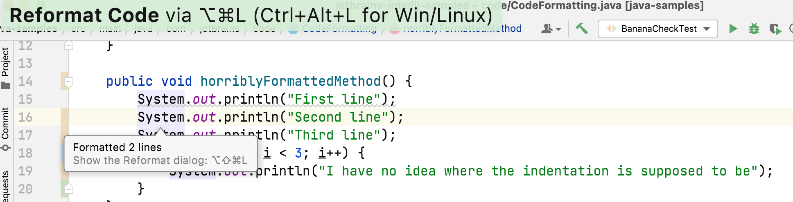

## Reformatting at the Class Level
Let's start with the basics for reformatting. While IntelliJ IDEA will do its best to place your caret in the right place, sometimes code can get out of alignment. There's a quick way to fix this code up. You can use **⌘⌥L** (macOS), or **Ctrl+Alt+L** (Windows/Linux) to reformat a selection of code. If you don't select any code the same shortcut will reformat the whole class. 

Let's press **⌘⌥L** (macOS), or **Ctrl+Alt+L** (Windows/Linux) in the class that contains this horribly formatted code:

```java
public void horriblyFormattedMethod() {
        System.out.println("First line");
           System.out.println("Second line");
        System.out.println("Third line");
        for (int i = 0; i < 3; i++) {
            System.out.println("I have no idea where the indentation is supposed to be");
        }
    }
```
The result is that two lines are reformatted, lines 20 and 23:



Using **⌘⌥L** (macOS), or **Ctrl+Alt+L** (Windows/Linux) will [reformat a code segment](https://www.jetbrains.com/help/idea/reformat-and-rearrange-code.html#reformat_code) as a one off act or [reformat a whole file](https://www.jetbrains.com/help/idea/reformat-and-rearrange-code.html#reformat_file) if you don't have anything selected. 

 Note: There are key conflicts with the operating system shortcuts on certain versions of Linux.

## Reformatting with Intention Actions
Let's keep working at the class level, and take a look at how are can format code with [intention actions](https://www.jetbrains.com/help/idea/intention-actions.html) in the next step.  
