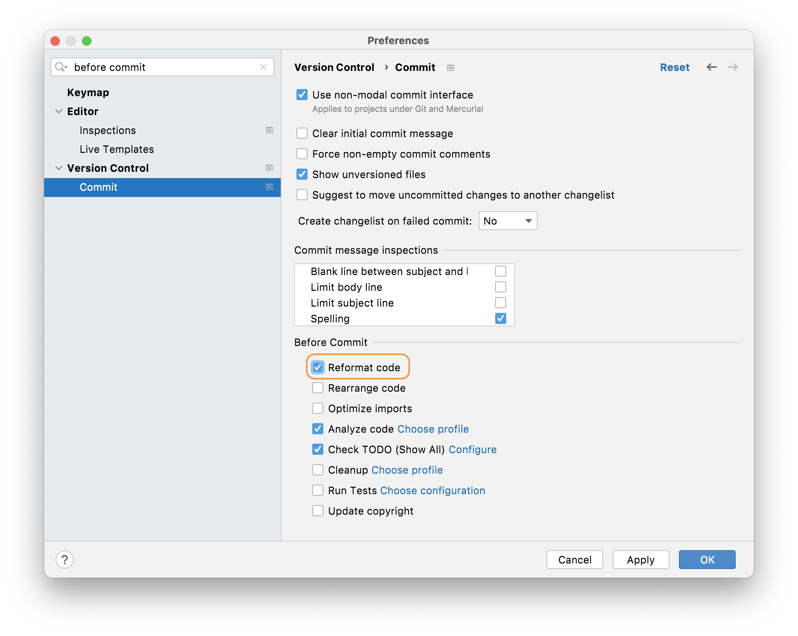
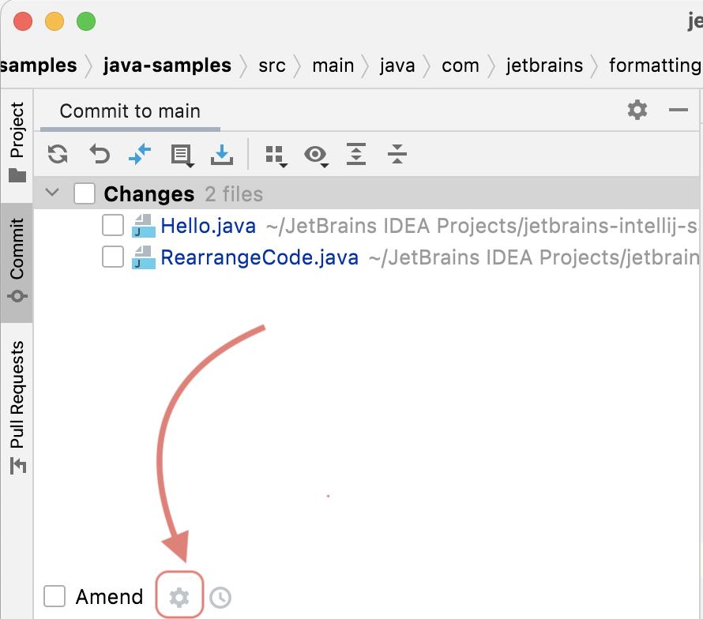

## Reformatting Before Commit  
If you always want to reformat code in this Project before you commit it, you can do this in one of two ways. You can either use **⌘,** (macOS), **Ctrl+Alt+S** (Windows/Linux) to display the Preferences/Settings and then search for _on commit_. The option you want is **Version Control > Commit** and then the **Before Commit** panel.

Select the **Reformat Code** checkbox and press **OK** to always reformat your files prior to commit according to your settings. This will apply to all your languages. 

Alternatively, you can use the cog in the Commit Tool Window which is invoked with **⌘0** (macOS), or **Ctrl+0** (Windows/Linux):

When you click the cog you'll see this dialog:

Select the **Reformat Code** checkbox and press **OK** to always reformat your files prior to commit. This will apply to all your languages from your next commit.

## Reformatting a Whole Directory
You may have decided to reformat your whole project directory by directory. We'll take a look at how to do this in the next step. 

