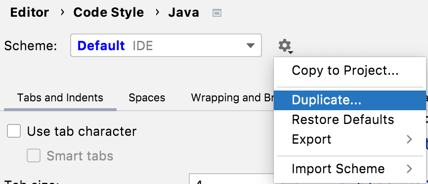
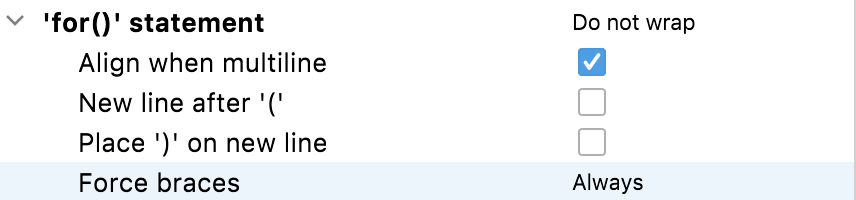

## Where and How to Change Settings for Reformat Code
You can view the settings for code formatting with **⌘,** (macOS), or **Ctrl+Alt+S** (Windows/Linux) to display the Preferences/Settings dialog. This dialog is searchable so the fastest way to find the settings is by typing in _code style_. You can then select the language you want to change the settings for. I'm going to use _Java_ for this tutorial. 

Before you go diving in and changing settings, be aware that these settings are defined at the project and IDE level. You can only have one Project scheme, and it's applied to your current project. If you want to change it, you need to first select the Default IDE scheme, then press the cog to the right of the drop-down and select Duplicate. You can subsequently copy this new scheme to your project if you want to.  

There are a lot of settings here, but the easiest way to familiarise yourself with them is to browse around and select or clear checkboxes to see the impact on the code to the right. The live-preview is very helpful for understanding what the impact will be. 

As a side note, if you do make some changes here, and you want to reset them without resetting all the settings, you can click the blue **Reset** link on the top-right of this dialog. It will only be shown when you've made a change to your settings.

If you go to the **Wrapping and Braces** tab and then scroll down to **'for()' statement**, you will see the **Force braces** change we made earlier when we changed it to _Always_.

We have a separate tutorial on rearranging your code which is included in the Code Style, so you can check that out if it interests you in the [tutorials section](https://www.jetbrains.com/idea/guide/tutorials/).

## Reformatting before you commit
Often you will want to apply your reformatting settings before you commit your code (whether that's the whole class or just code that you've changed). We'll look at how to do this in the next step of the tutorial. 