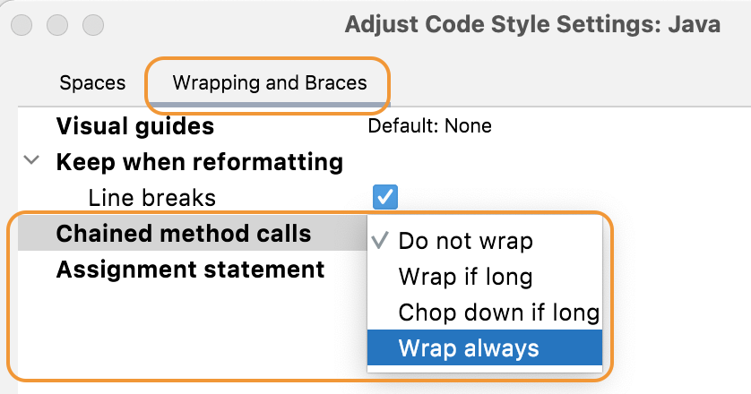
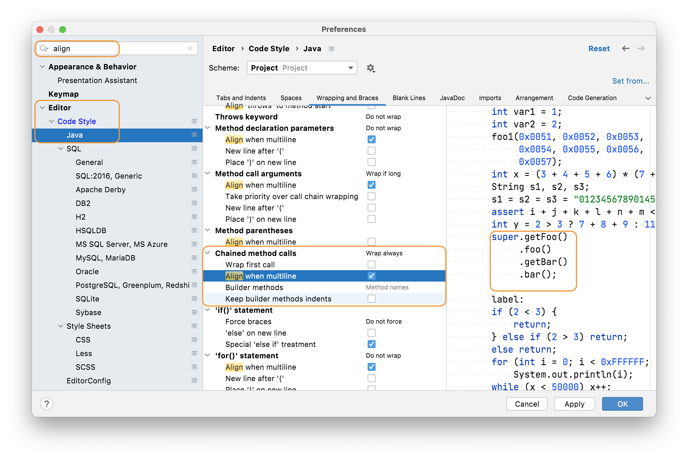

## A Before and After Example of Code Rearrangement
Let's take a look at some code that we will reformat. We will use Java 8 Streams for this. At the moment, our Code Style settings mean that our stream operators are long chained method calls which makes for an extremely long line of code:

```java
private int replaceWithMapToInt() {
    int count = integerStringMap.values().stream().filter(Objects::nonNull).flatMap(Collection::stream).filter(stringVal -> stringVal.contains("error")).mapToInt(String::length).sum();
    return count;
}
```

Let's say you want to change your Code Style Settings so that your Stream operations are always on separate lines, and they are lined up underneath each other. Instead of going into settings, you can highlight the code and then use [intention actions](https://www.jetbrains.com/help/idea/intention-actions.html) by pressing **⌥⏎** (macOS), or **Alt+Enter** (Windows). Select **Adjust code style settings** and go to your Wrapping and Braces tab. As you make changes here, they will be previewed in your editor. Locate the _Chained method calls_ to **Wrap always**:



Our code is looking better, but it's not quite there:

```java
private int replaceWithMapToInt() {
        int count = integerStringMap.values()
                .stream()
                .filter(Objects::nonNull)
                .flatMap(Collection::stream)
                .filter(stringVal -> stringVal.contains("error"))
                .mapToInt(String::length)
                .sum();
        return count;
    }
```

You also want all the dots to line up vertically under `.values` in this case. For this setting we'll need to into in the Settings themselves with (macOS), or **Ctrl+Alt+S** (Windows/Linux) and then type in _align_ to filte the results. Navigate to **Editor > Code Style > Java > Wrapping and Braces** and find the option called _Chained method calls_ again. This time select the **Align when multiline** checkbox:



Now when you press **OK** your code should look like this:

```java
private int replaceWithMapToInt() {
        int count = integerStringMap.values()
                                    .stream()
                                    .filter(Objects::nonNull)
                                    .flatMap(Collection::stream)
                                    .filter(stringVal -> stringVal.contains("error"))
                                    .mapToInt(String::length)
                                    .sum();
        return count;
    }
```

This is much easier to read than the long line you started with!

## Summary
Now we've looked at when, how and why you can reformat your code, let's summarise it all with further reading and the shortcuts we used. 