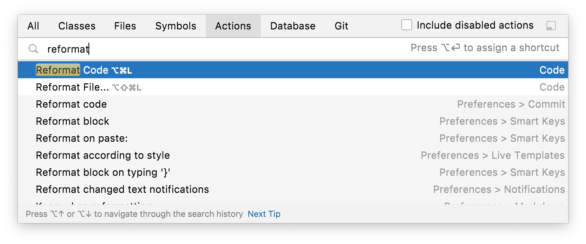
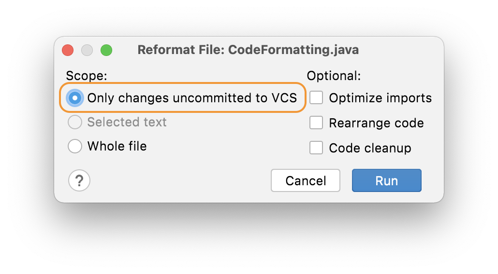

### Reformatting Only Code You Have Changed
As we talked about in the previous step, you can use the keyboard shortcut **⌘⌥L** (macOS), or **Ctrl+Alt+L** (Windows/Linux) to reformat a selection of code or the whole class according to your reformatting settings. You can also invoke it at a class level with **⌘⇧A** (macOS), or **Ctrl+Shift+A** (Windows/Linux), to bring up the Find Actions dialog and then type in _Reformat Code_:

Press **Enter** on the **Reformat Code** option to apply the current reformatting settings to your class. 

However, often you don’t want to reformat the whole file that you’re working on, particularly if this is a code base with inconsistent formatting. You don't want to commit a lot of white space changes as well as the feature or bug fix that you've done.  If you are working on a file with some inconsistently formatted code, but you’ve only changed a small part of it, using **Reformat Code** might change parts of the file you haven't touched. In this instance, you would ideally like to highlight the code you’ve changed and [just reformat that](../reformatting-a-selection-or-class), but that won’t work when your changes are scattered throughout the file.

In this instance, you can use **⌥⇧⌘L** (macOS), or **Ctrl+Alt+Shift+L** (Windows/Linux) to bring up the reformatting options dialog:

In this dialog, select **Only changes uncommitted to VCS**. When you press **Run**, IntelliJ IDEA will reformat the lines in the file that you've changed and nothing else.

## Reformatting with Intention Actions
Let's take a look at how you can reformat code with [intention actions](https://www.jetbrains.com/help/idea/intention-actions.html) in the next step.