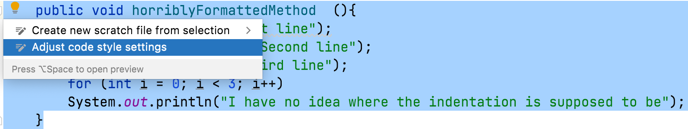
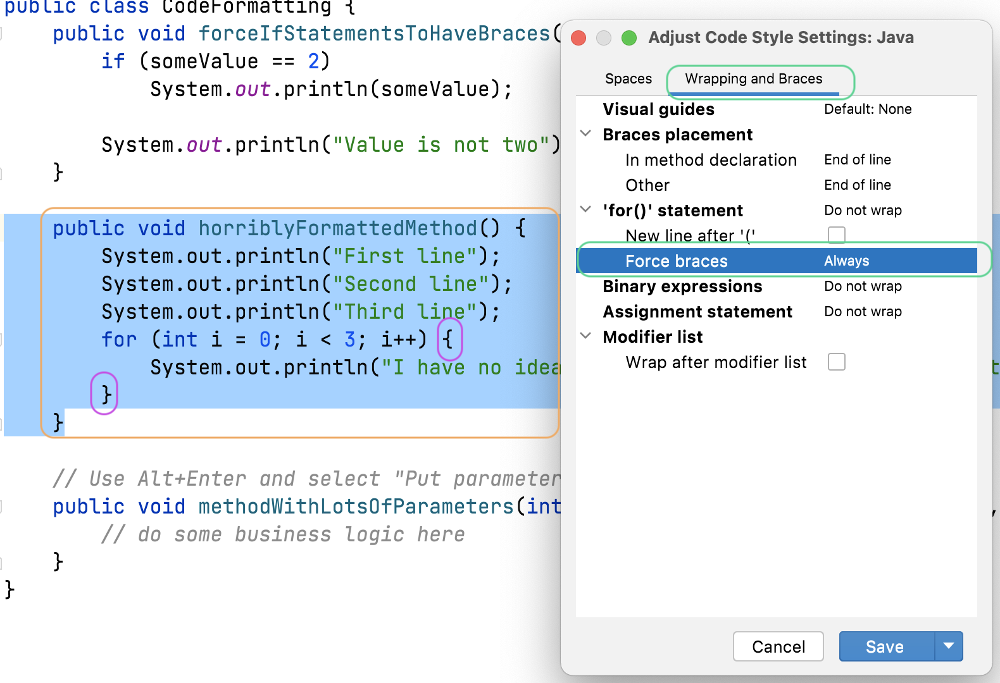

## Reformat with Intention Actions 

Intention Actions is one of those shortcuts in IntelliJ IDEA that works in a number of places, even if IntelliJ IDEA has not specifically highlighted the code.  

In this code snippet, let's say you want your `for` loop to have curly braces. You can highlight it and then press
:

When you press **Adjust code style settings** IntelliJ IDEA will do two things. Firstly, it will show you a preview of the code reformatted according to your current reformatting rules (more on that in the next step), secondly it will show you the settings that apply to that bit of code.

You can go to the **Wrapping and Braces** tab and change **Force Braces** to _Always_. 

You get a live preview of what your code will look like if you press **Save**. When we save these changes, they are saved to your current [code style scheme](https://www.jetbrains.com/help/idea/configuring-code-style.html).

If you don't like the changes and press **Escape** or **Cancel** to leave the dialog without saving, the code will revert to its previous formatting and without the curly braces on our `for` loop.

## Reformatting Code Settings
You might want to configure the code style for your project. We'll take a look at the settings to achieve that in the next step of this tutorial. 