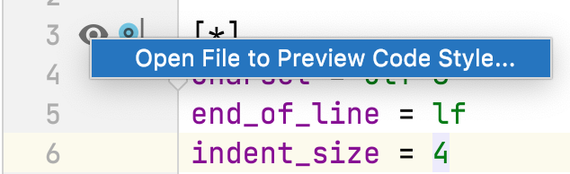

## Ensuring EditorConfig File Functionality is Enabled
To use [EditorConfig files](https://www.jetbrains.com/help/idea/configuring-code-style.html#editorconfig) in IntelliJ IDEA you need to make sure that the _EditorConfig_ plugin is enabled. Have a look at the [plugins help](https://www.jetbrains.com/help/idea/managing-plugins.html) if you're not sure how to do this.

### Working with .editorconfig Files
IntelliJ IDEA allows you to manage all code style settings with a `.editorconfig` file providing the plugin is enabled. You need to put your `.editorconfig` file(s) into the root directory that contains the files whose settings you want to be managed with the `.editorconfig` file.

All options from the `.editorconfig` file are applied to the directory it's in, as well as all of its sub-directories on top of the current project code style. If anything is not defined in `.editorconfig`, it's taken from the project settings. This means that it takes priority over settings that also appear in the IntelliJ IDEA Preferences/Settings dialog.

Some settings in an `.editoconfig` file are IntelliJ IDEA specific, these are prefixed with `ij_`. 

### Adding an EditorConfig File
Let's take a look at [adding a `.editorconfig` file](https://www.jetbrains.com/help/idea/configuring-code-style.html#66e1c5ae) to your project

The easiest way to do this is by using **⌘1** (macOS), or **Alt+1** (Windows/Linux) to display the Project Window and then use **⌘N** (macOS), or **Alt+Insert** (Windows/Linux) to get the **New** dialog. Type in _editor_ and the results will be filtered to the `.editorconfig` files. 

When you press **Enter** you will get the choice to configure your new `.editorconfig` file. 

You can select the properties you want to define and IntelliJ IDEA will create stubs for them. If you leave the checkboxes empty IntelliJ IDEA will not populate the file with stubs - you can add them manually later.  

### Previewing Changes from EditorConfig File
You can preview how changes in your `.editorconfig` file will impact your code by pressing the _eye_ gutter icon and selecting the file in the directory listing that you want to preview.

When you select your file, any changes you make in the `.editorconfig` file will be reflected in the preview. The changes won't be saved and applied in this view. If your preview window doesn't appear, ensure you have selected the _Editor and Preview_ icon in the top-right hand corner. 

## A Worked Example for Reformat Code
Let's take a look at a worked example in the next step of this tutorial.