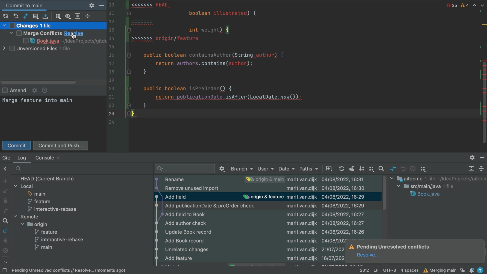

## Git Merge Dialog

At some point in your career, probably many points, you'll have to resolve merge conflicts. A common cause of merge conflicts is when you're working on a `feature` branch while other changes have been applied to the `main` branch. In this tutorial, we are currently on the `main` branch, and we want to merge the `feature` branch into `main`. We can do this by clicking the `feature` branch in the Git tool window which is ⌘9 (macOS), or Alt+9 (Windows/Linux) to open. Select the `feature` branch and then choose **Merge 'feature' into 'main'**.

When you press **⏎** (macOS), or **Enter** (Windows/Linux), IntelliJ IDEA opens a popup telling us there are merge conflicts. 

The Conflicts dialog offers us several options:

- **Accept yours** which will apply the changes on the current branch (main) and discard the changes from the other branch (the feature branch).
- **Accept theirs** which will apply the changes from the other branch (so, the feature branch) and discard the changes from main.
- **Merge** which will open up the merge dialog. We will focus on this option in this tutorial.

If you are unsure about which is "yours" and which is "theirs", note that these are also visible in the table to the left of the buttons and the branch names are mentioned in brackets. 

You see that both branches have been _Modified_. Choosing either **Accept yours** or **Accept theirs** in this case would discard the changes made on the `feature` or `main` branch respectively. Only choose those options if you want to discard those changes.

If you click **Close** in the Conflicts dialog, IntelliJ IDEA will tell us that the **feature was Merged with Conflict**and you can click **Resolve** to reopen the **Conflicts** dialog.

Alternatively, if you accidentally click **Close**, a Merge Conflicts node will appear in the Local Changes view too. You can open the _Commit tool window_ using **⌘+0** (macOS), or **Alt+0** (Windows/Linux) and open the file.

Click the arrow **>** to see the Merge Conflicts node. You can click **Resolve** to reopen the **Conflicts** dialog. 