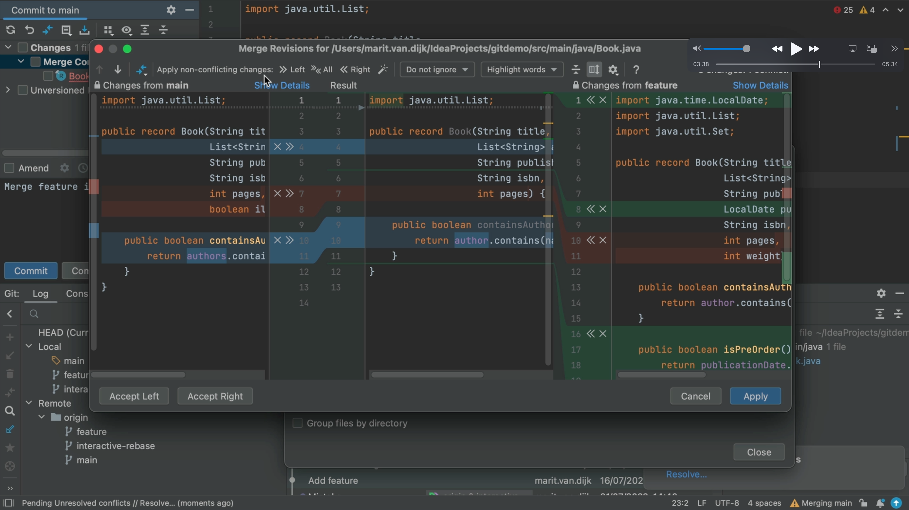
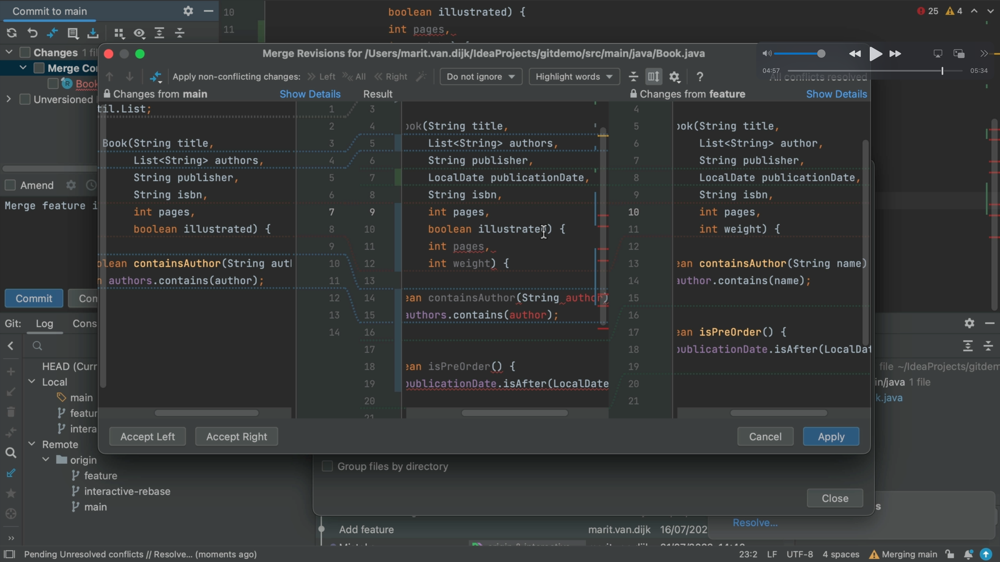

## Resolving Merges

Back on the **Conflicts** dialog, there are changes on both branches that we want to keep so let's click **Merge** to open the _Merge Revisions_ dialog. Here we can see the changes to our current branch (main) on the left, and the changes that we want to merge from the feature branch on the right. There is a fully-functional editor in the middle.

There are several changes:

- a removed line is shown in grey 
- lines that were added are shown in green 
- lines that were changed are shown in blue; the changes made are highlighted 
- conflicts are shown in red

For each change we can decide to ignore it by clicking the **x** or to accept it by clicking the arrows **>>**.

You can use **⌘**+**Z** (macOS), or **Ctrl+Z** on (Windows/Linux) to undo an action here if required.

Depending on the number of changes, accepting or ignoring each change individual change might take some time. You can merge all non-conflicting changes automatically with **Apply All Non-Conflicting Changes**. 

Alternatively, you can use **Apply Non-Conflicting Changes from the Left Side** or **Apply Non-Conflicting Changes from the Right Side** to merge non-conflicting changes from the left/right parts of the dialog respectively. When you accept all the changes, the **Left/All/Right** buttons are unavailable as there are no more non-conflicting changes to apply. There is just one remaining conflict.

Another way of resolving conflicts is to right-click on the highlighted conflict in the central pane and use the commands from the context menu. 

When you select **Accept the left side** or **Accept the right side**, the change from the selected side will be applied and the change on the other side will remain open. When you choose **Resolve using Left** or **Resolve using Right**, the changes from either the left or right respectively will be applied and the changes from the other side will be ignored. In this example, lets combine the changes from both sides, so we will choose to accept them both.

At this point, IntelliJ IDEA has concluded that all changes have been processed, so we can choose to Save changes and finish merging which will close this dialog.

However, as we can see from the error highlighting this doesn't look quite right. The reason here is that both branches have added fields to this record, so we need to fix these brackets here. 

The middle pane is a fully-functional editor, so you can edit this out. 

There, that looks much better. You can click **Apply** to finish resolving your merge conflicts.