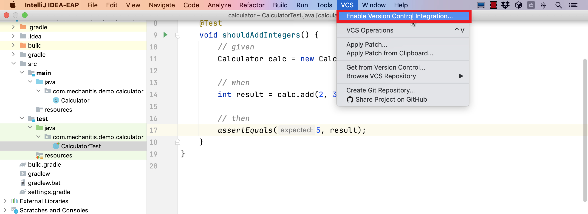
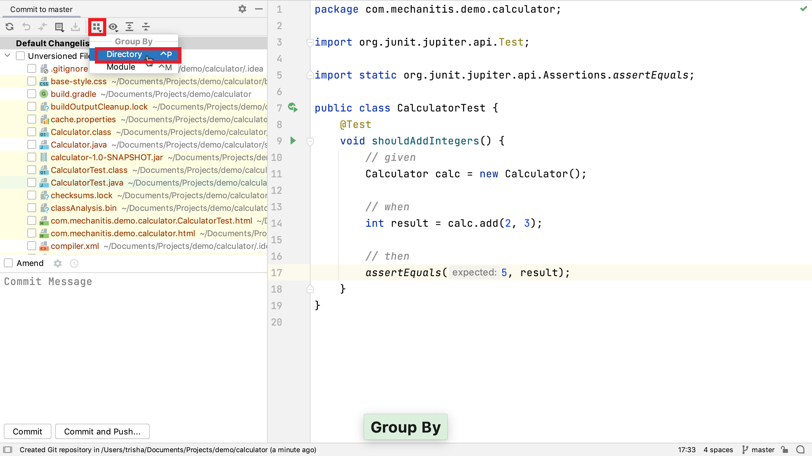
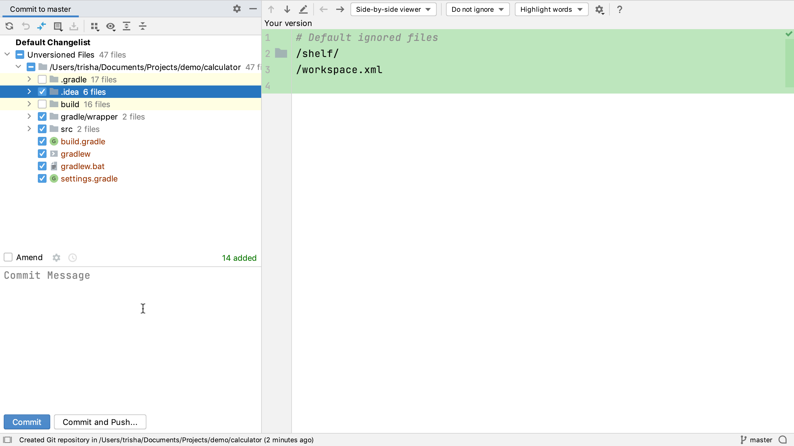
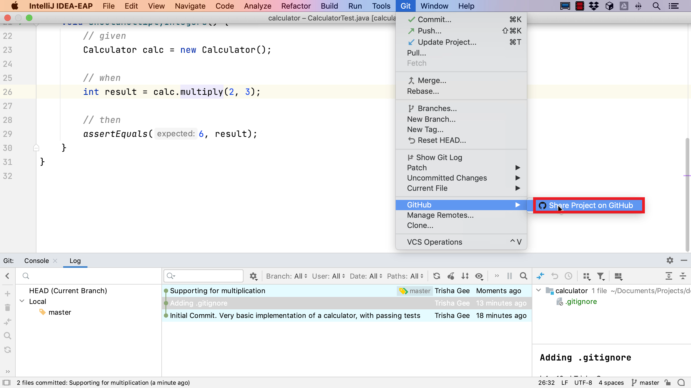
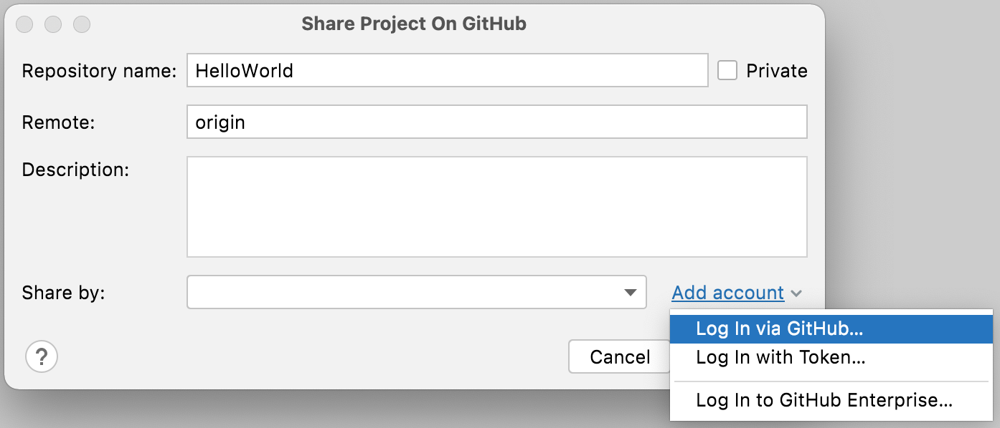
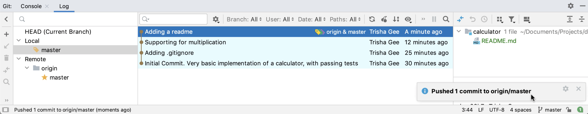

## Creating a Local Repository First and Sharing it to GitHub Later

The first approach we looked at assumed that you want to do everything in a single step. However, sometimes you want to create a local Git repository for your project well before you publish it publicly on GitHub.

Let’s assume you have a more complex project than Hello World and that you’re still in the process of writing the code. You don’t want to publish your project on GitHub just yet, but you do want to enable source control for it as you want to do small commits locally while you evolve the code. 

### Creating a Local Repository

You can check that your project isn't under version control by checking if you can see your Git tool window with **⌘9** (macOS), or **Alt+9** (Windows/Linux). If you can't see the Git tool window, your project is not yet a Git project. 

To use Git as the version control for an IntelliJ IDEA project, go to **VCS > Enable Version Control Integration** and select Git from the drop-down menu. 

IntelliJ IDEA will now create a Git repository in the root directory of the project. We also now have access to the Git tool window with **⌘9** (macOS), or **Alt+9** (Windows/Linux). 

If you open this, you can click on the [Console tab](https://www.jetbrains.com/help/idea/version-control-tool-window-console-tab.html) to see the Git commands that have been run and their result, or you can switch to the visual [Log tab](https://www.jetbrains.com/help/idea/log-tab.html). You can now also see that there's a `.git` folder in your project, either from the Project Window **⌘1** (macOS), **Alt+1** (Windows/Linux), or you can use IntelliJ IDEA’s terminal with **⌥F12** (macOS), or **Alt+F12** (Windows/Linux) to list the project’s files.

Now you’ve enabled Git, but you haven’t added anything to source control yet. We can see that our files are shown in red, which means as far as Git is concerned, these are new files that are not yet added to Git, so they’re not in version control. Let’s select which files we want to be in version control, and make our first commit.

### Making Your First Commit Locally

You can open the commit window using **⌘K** (macOS) **Ctrl+K** (Windows/Linux). The tutorial uses the [Commit Tool Window](https://www.jetbrains.com/help/idea/commit-and-push-changes.html#commit-tool-window), which was added in IntelliJ IDEA 2020.1. If you’re still using the old commit dialog, you can switch to the commit tool window in your Preferences/Settings  **⌘,** (macOS), or **Ctrl+Alt+S** (Windows/Linux) and then search for _Use non-modal commit interface_.

If you open up the unversioned files list in this Commit window you can see all the files in your project are listed because none of them have been added to Git yet. You probably don’t want to add everything to Git. There are some directories and files, like build output files, that we don’t need to put under source control. Seeing all the files in a single list like this might not be helpful, so we could opt to group the files, for example by directory or module. 

In this example, there are two directories that we don’t want to add to Git because they’re build directories. We do want to add the gradle wrapper directory, the source, and the files in the root of my project. If we open up the `.idea` folder, we can see all IntelliJ IDEA’s settings files. Each team will have their own idea of which settings should be saved into source control, if any. IntelliJ IDEA automatically adds a [.gitignore file](https://git-scm.com/docs/gitignore) to this directory with default folders and files to exclude from source control. We could add other files to this `.gitignore` file if there are other specific IDE settings that we don’t want to include. However, you can add all the other settings files to Git.

Add a description for this commit describing what functionality these changes do. When you commit this, you get a balloon saying this was successful. When you go back to the Git window with **⌘9** (macOS), or **Alt+9** (Windows/Linux) the Log tab shows us this commit. You can see the files that were changed in this commit and the commit message. You can hide the Git window by pressing **⌘9** (macOS), or **Alt+9** (Windows/Linux) again.

### Creating a Repository on GitHub

So far you have been committing all these changes to your local Git repository. If you open the Log tab again with **⌘9** (macOS), or **Alt+9** (Windows/Linux), you can see this project only has local branches, which means all the code and the commit history is only saved on this local computer. Once you finished setting up your project and are ready to share it and its history publicly on GitHub, go to **Git > GitHub > Share Project on GitHub**.

You can use IntelliJ IDEA to create a local Git repository and then share the project on GitHub by going to **VCS >  Share project on GitHub** in the menu.

This displays the Share Project on GitHub dialog. Here you can give your GitHub repository a name, choose if you want it to be private, change the Remote (we recommend you don't), and give your project a description. Project names must be unique in your GitHub repository and follow the GitHub guidelines.

### Maybe Required - Authenticating with GitHub

If you're not authenticated with GitHub you will see an additional _Add Account_ link which has different options:

We'll focus on the top two options in this tutorial. Firstly, if you select **Log in via GitHub**, a window will open in your default browser asking you to log in to your GitHub account and authenticate it with IntelliJ IDEA.

Alternatively, you can select **Log in with Token** to open the Add GitHub account dialog. Here when you press **Generate** a window will open in your default browser asking you to log in to your GitHub account, and then you can generate a token for use in IntelliJ IDEA. You can follow the instructions on GitHub to do this. Once you have generated the token you can paste it back into the dialog to authenticate with GitHub.

Both these methods achieve the same result in that they allow IntelliJ IDEA to authenticate with GitHub.

When you press **Enter** or click **Share**, IntelliJ IDEA will create a new repository on GitHub under the account and push this code to that repository. The balloon notification shows when this is complete, so we can click on the link and see the new repository on GitHub in a browser. We can see the code on the project, and the three commits that we made locally are now available on GitHub.

### Sharing a Project on GitHub

If you go back to IntelliJ IDEA, you can see the Git Log has been updated to show that the remote origin, is also at this commit. When you expand the Remote branches you can see the master branch under the origin remote. This shows us everything has been successfully pushed to GitHub, and that IntelliJ IDEA is also up-to-date with all the information from the GitHub remote.

We recommend not waiting too long to push your project to GitHub since putting the project on a remote server like GitHub means that the code is safely backed up to another location.