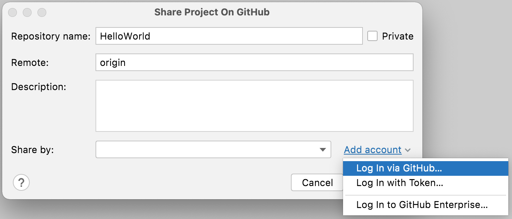

## Creating a Local Repository and Sharing it to GitHub in One Step

Let's look at how we can enable version control for our project, authenticate with GitHub, create our first commit, and share our project on GitHub in one step. 

### Sharing a Project on GitHub

You can use IntelliJ IDEA to create a local Git repository and then share the project on GitHub by going to **VCS >  Share project on GitHub** in the menu.

This displays the Share Project on GitHub dialog. Here you can give your GitHub repository a name (must be unique in your repository), choose if you want it to be private, change the Remote (we recommend you don't), and give your project an optional description.  

### Optional - Authenticating with GitHub 
If you're not already authenticated with GitHub you will see an additional _Add Account_ link which has different options:

We'll focus on the top two options in this tutorial. Firstly, if you select **Log in via GitHub**, a window will open in your default browser asking you to log in to your GitHub account and authenticate it with IntelliJ IDEA. 

Alternatively, you can select **Log in with Token** to open the Add GitHub account dialog. Here when you press **Generate** a window will open in your default browser asking you to log in to your GitHub account, and then you can generate a token for use in IntelliJ IDEA. You can follow the instructions on GitHub to do this. Once you have generated the token you can paste it back into the dialog to authenticate with GitHub.

Both these methods achieve the same result in that they allow IntelliJ IDEA to authenticate with GitHub.

Tip: if you have multiple GitHub accounts, you can [add your GitHub accounts](https://www.jetbrains.com/help/idea/github.html) in the Settings/Preferences with **⌘,** (macOS), or **Ctrl+Alt+S** (Windows/Linux) and then search for _GitHub_. You can use the **+** to add multiple GitHub accounts.

### Creating a Repository on GitHub

Now you can press **Enter** or click **Share**, IntelliJ IDEA will go ahead and create that repository on your GitHub profile. 

### Making Your First Commit 
The IDE will ask you which files you want to put into this first commit. You could commit everything, but generally you don’t need to add the `.gradle` folder (if you’re using the [Gradle wrapper](https://docs.gradle.org/current/userguide/gradle_wrapper.html)), and we don’t need to add the build folder, which is where IntelliJ IDEA puts the compiler output like class files.

Everything else looks good to commit, you can use the default commit message and click **Enter** to commit it.

### Sharing a Project on GitHub

IntelliJ IDEA creates a local Git repository for the project and then pushes it to your GitHub profile as a new repository with the details you just entered. 

When this process is finished, IntelliJ IDEA will pop up a balloon, and you can click on the link to see the repository in GitHub in a browser. 

We can see the repository, the code, the commit message, and the description in GitHub too.

