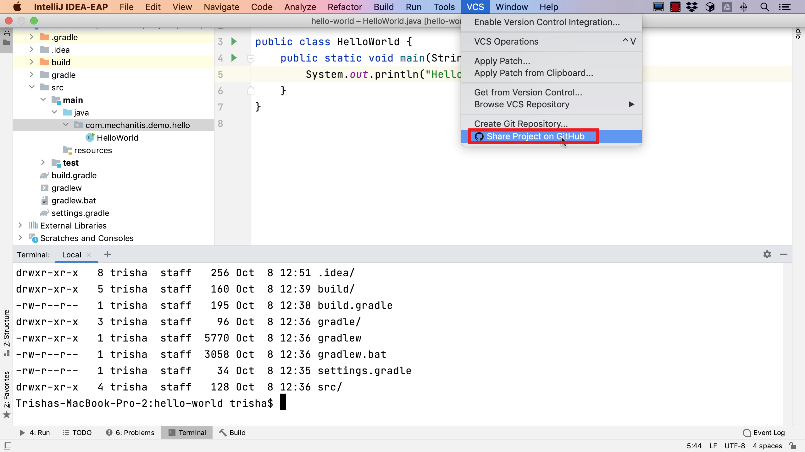
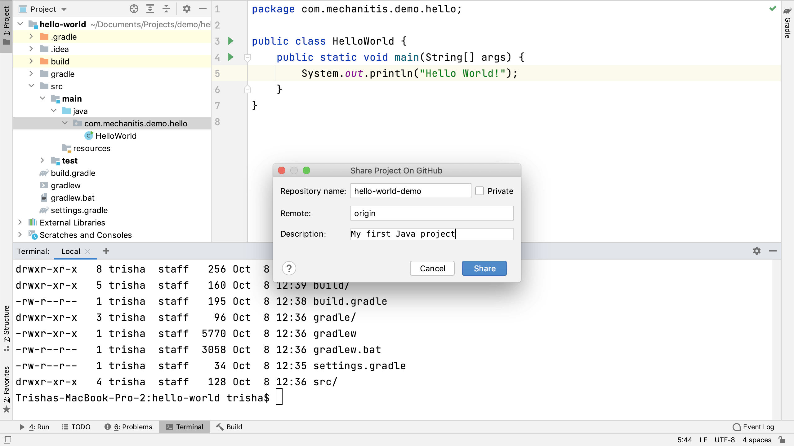
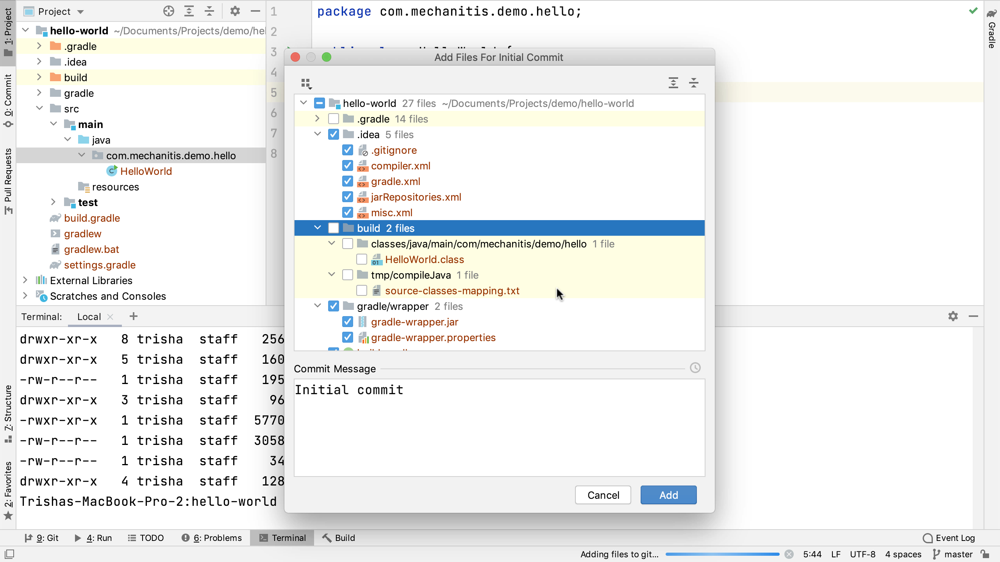
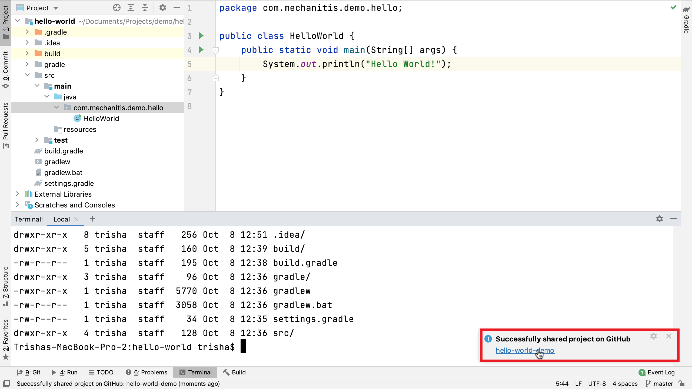
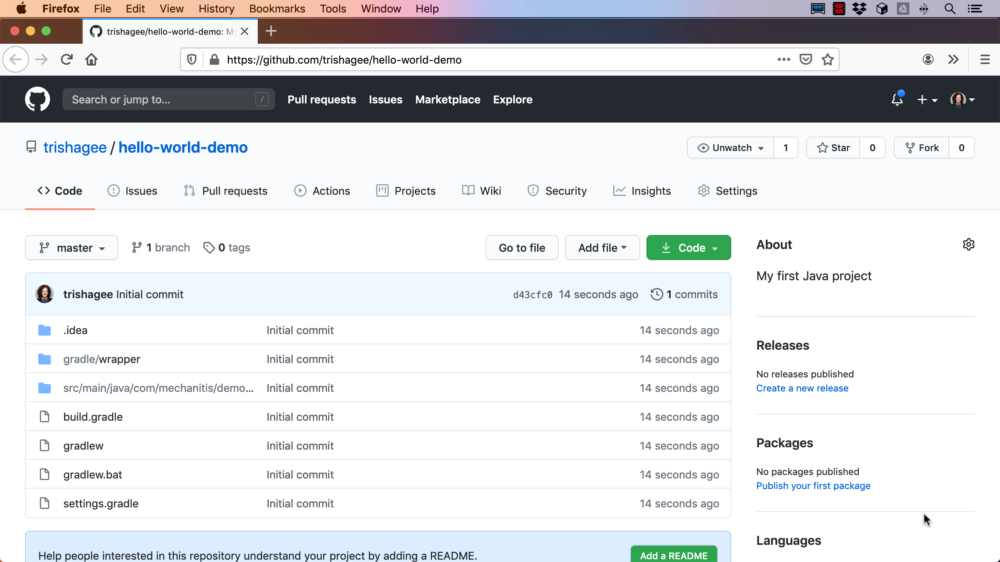

Let’s assume we’ve created an IntelliJ IDEA project containing the code we want to share on GitHub. In this tutorial, we use a sample Hello World application that we know works because we’ve seen it run successfully. It’s not currently set up with any source control, which we can see in IntelliJ IDEA because there’s no option for opening a Git window, and if we list the project’s files in the Terminal window, we can see there’s no `.git` folder in the project. 

We can use IntelliJ IDEA to share this project on GitHub by going to *VCS >  Share project on GitHub* in the menu.

If we’re not already logged in to GitHub via IntelliJ IDEA, we’ll be shown a log in dialog where we can enter our GitHub username and password. This also provides the option to log in using a token from GitHub, but even if we don’t select that option, if we log in with our username and password here IntelliJ IDEA will generate a GitHub token and use that to log in. If you don’t already have a GitHub account, you can use the _Sign up for GitHub_ link in IntelliJ IDEA to create one. If you log in with your username and password, and have two-factor authentication enabled for GitHub, IntelliJ IDEA will pop up an additional dialog asking you to input your authentication code.

Tip: if you have multiple GitHub accounts, you can [add your GitHub accounts](https://www.jetbrains.com/help/idea/github.html) by going to the IDE Preferences -> Version Control -> GitHub. Use the add button to add your accounts.

Once we’re successfully logged in, IntelliJ IDEA will ask us what we want to call the repository that we’re about to create on GitHub. This defaults to the project name, but we can pick any name for this repository, as long as it follows GitHub’s guidelines. For my Hello World project, I will call our repository hello-world-demo, as repositories have to have a unique name and I’m sure there’s already a repository called hello-world on my GitHub account. You can make this repository private if you like. I like to make my repositories public, unless there’s a compelling reason to make them private. You can rename the remote if you like, but I will accept the default here. I will also add a description too. This isn’t mandatory, but it helps people who want to understand what the project is for.

When we press *Enter* or click *Share*, IntelliJ IDEA will go ahead and create that repository on our GitHub profile. The IDE will ask us which files we want to put into this first commit. We could commit everything, but generally we don’t need to add the .gradle folder (if we’re using the [Gradle wrapper](https://docs.gradle.org/current/userguide/gradle_wrapper.html), and we don’t need to add the build folder, which is where IntelliJ IDEA puts the compiler output like class files.

Everything else looks good to commit, we’ll use the default commit message and click Enter to commit it.

Under the covers, IntelliJ IDEA is creating a local Git repository for the project and then pushing it to your GitHub profile as a new repository with the details we just entered. When this process is finished, IntelliJ IDEA will pop up a balloon and we can click on the link to see the repository in GitHub in a browser. We can see the repository, the code, the commit message, and the description.

