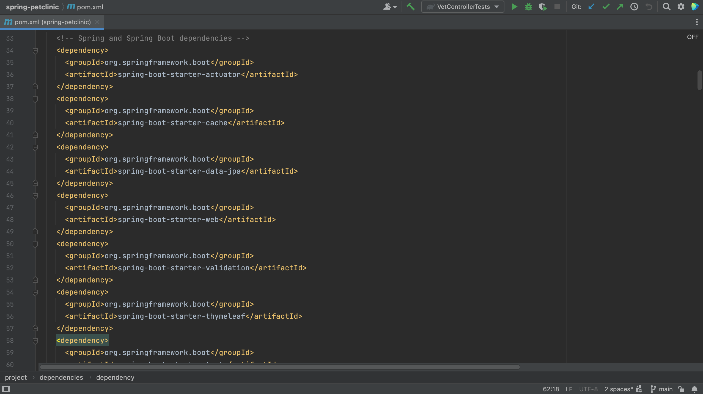
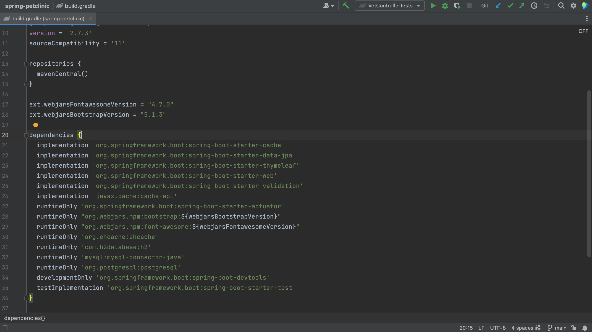

You can find direct dependencies in the dependency management config file. Direct dependencies are the dependencies that your project depends on directly. They are declared in the dependency management config file.

One example is this pom.xml in a Maven project.

Another example is the build.gradle in a Gradle project. 

Note that the dependency management config file includes only declared dependencies and not their transitive dependencies (or the dependencies that these declared dependencies depend on).