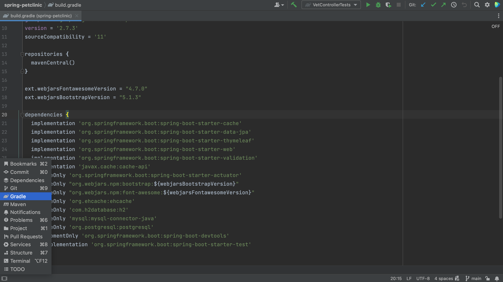

To see direct dependencies and their transitive dependencies, we can look in the Build tool window. 
There is no shortcut to open the Build tool window. We can open it by clicking **Quick Launch** in the bottom-left and selecting **Gradle**, or **Maven** depending on what we're using.

Alternatively, we can open it by using Recent Files, **⌘E** (on Mac) or **Ctrl+E** (on Windows/Linux), and typing "gradle" or "maven", or the name of your build system.

The Build tool window shows you each IntelliJ IDEA module separately, and each module’s "Dependencies" folder shows you all your dependencies in a hierarchical structure. We can expand our dependencies to see their transitive dependencies.

