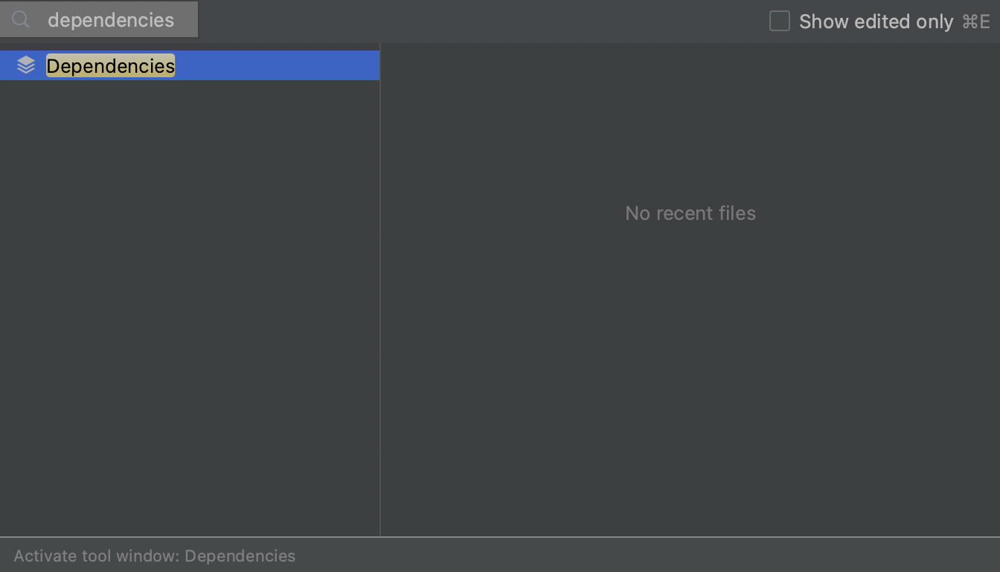
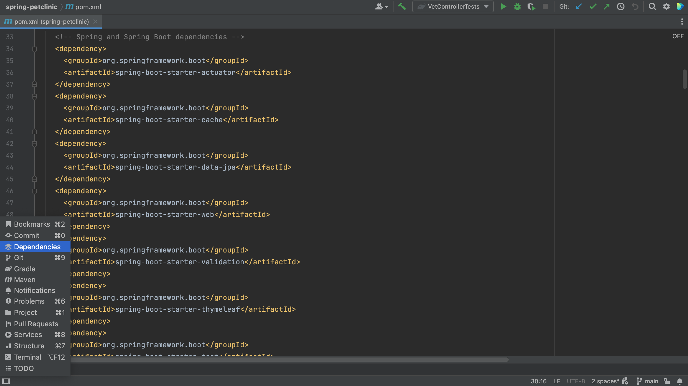
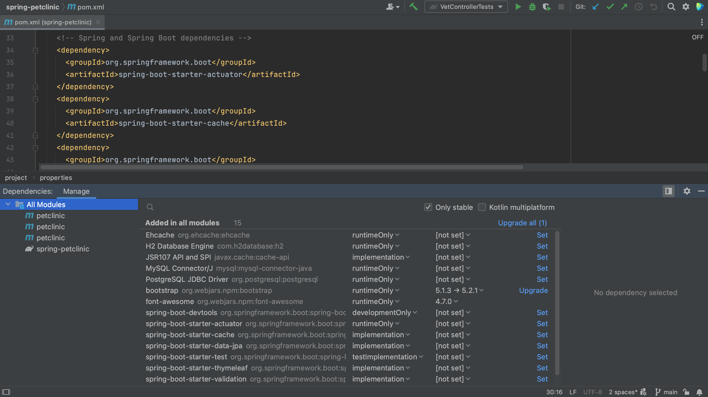
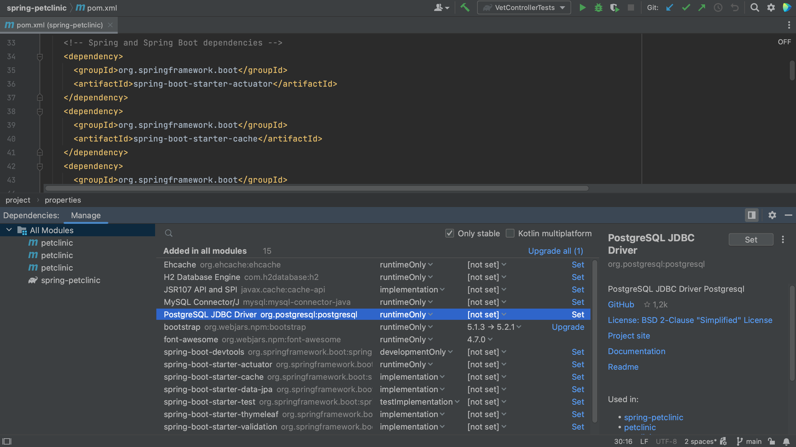

Finally, we can view and manage dependencies in the Dependencies tool window. The Dependencies tool window becomes available when the current project has at least one supported module. All types of dependencies are supported for Maven. For Gradle only a top level `dependencies { }` block is supported in the build script.

Since there is no shortcut to open the Dependencies tool window directly either, we can again use Recent Files, **⌘E** (on Mac) or **Ctrl+E** (on Windows/Linux), and type in "dependencies" to open the Dependencies tool window. 

Alternatively, we can open it by clicking **Quick Launch** in the bottom-left and selecting Dependencies.

Here we can see our project’s direct dependencies. Select "All Modules" to see the dependencies for all modules, or select an indivual module to see the dependencies for that specific module. The Dependencies tool window shows direct dependencies, and not their transitive dependencies. 

We can see details about a selected dependency in the dependency details pane.

The dependency details pane displays the information about the selected dependency, such as:
* Repository or repositories where it's available, for example Maven Central
* A description if it is available
* GitHub information if the dependency sources are hosted on GitHub
* The licence under which an open source library is available
* A link to the project website, documentation and readme
* List of usages in the current module.
* Authors if available
* Supported Kotlin or Multiplatform platforms if it is a Kotlin Multiplatform dependency