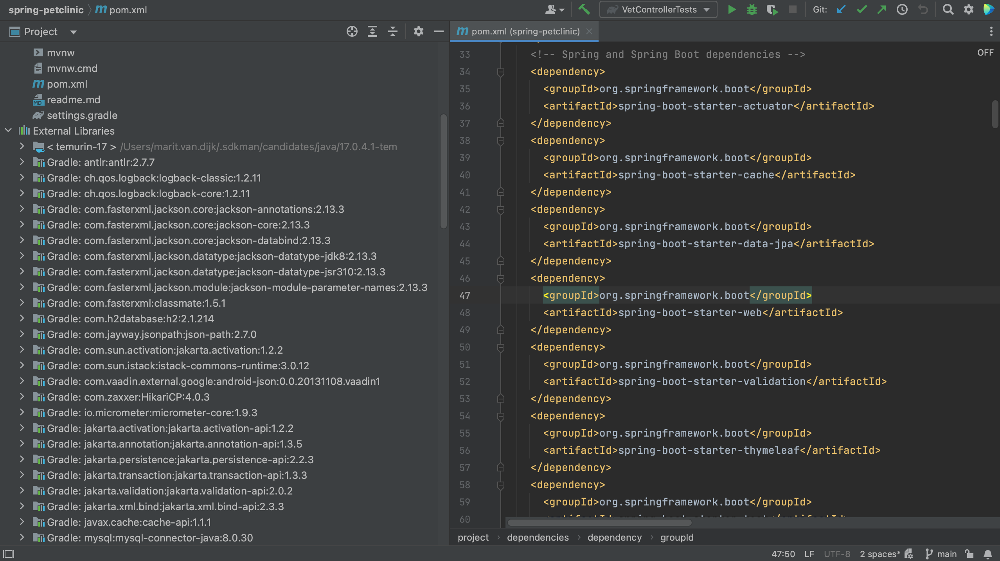

In the Project tool window, **⌘1** (on Mac) or **Alt+1** (on Windows/Linux), under **External Libraries** we can see all the JAR files needed by our application, including the transitive dependencies. However, we cannot tell the difference between direct dependencies and transitive dependencies. One declared dependency might bring in multiple JAR files.

