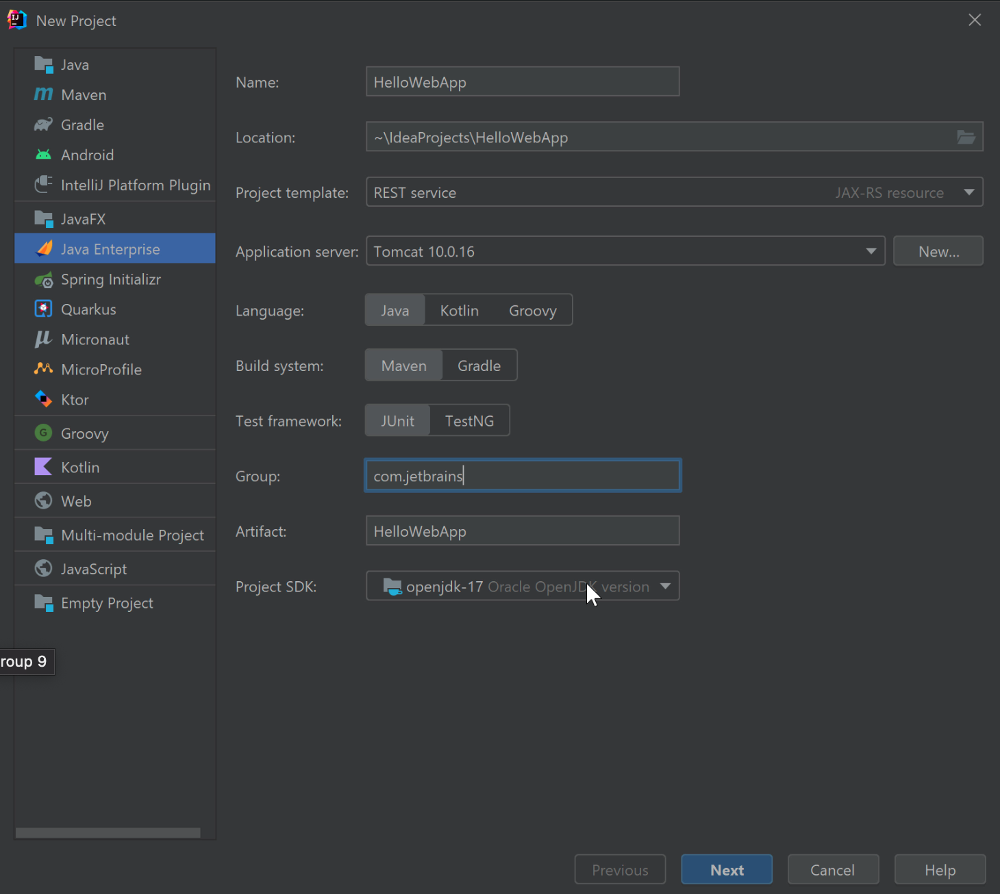
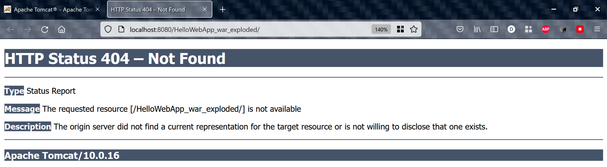
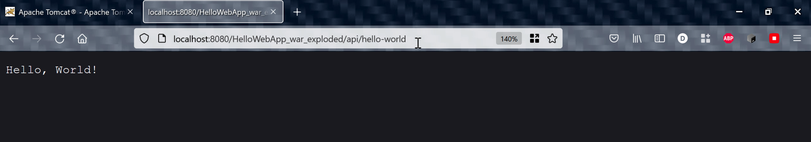

We're going to create a small web application that runs on Tomcat to demonstrate the integration in IntelliJ IDEA Ultimate:

1. From the Welcome Screen select New Project. 
2. If you have an existing project open, click **File > New**. Select **Java Enterprise** on the left-hand menu and enter the following details:

| Field Name            | Description                                                                                                                                                                           |
|-----------------------|---------------------------------------------------------------------------------------------------------------------------------------------------------------------------------------|
| Name                  | The name of your project, such as `HelloWebApp`.                                                                                                                                      |
| Location              | The location of your project.                                                                                                                                                         |
| Create Git repository | Select this checkbox if you want to use Git to version control the files in this project.                                                                                             |
| Template              | We want to create a RESTful web application so leave the `REST service` template selected.                                                                                            |
| Application Server    | Select **New** &gt; **Tomcat Server**. For the Tomcat Home, browse to the directory where you have Tomcat installed. This will also populate the Tomcat base directory. Click **OK**. |
| Language              | This blog post uses Java.                                                                                                                                                             |
| Build System          | This blog post uses Maven.                                                                                                                                                            |
| Group                 | You can change this if required or leave it as the default `com.example`.                                                                                                             |
| Artifact              | This is the name of your project by default. You don't need to change it.                                                                                                             |
| JDK                   | I'm using JDK 17 for this blog post.                                                                                                                                                  |

3. Click **Next** to go to the next step in the tutorial and select Jakarta EE 9 from the Version drop-down. The Eclipse Jersey Server and Weld SE have been preselected for us because we selected REST service as the template in the previous step. 
4. Click **Create** to set up the project. IntelliJ IDEA will now create our simple web application which will output “Hello, World!” when it receives a GET request.

You can open the Services window with **⌘8** (macOS), **Alt+8** (Windows/Linux) to see the Tomcat server we just configured along with our web application.

We can run our application with **^R** (macOS), or **Shift+F10**  (Windows/Linux) and this starts our Tomcat server. In the Run window **⌘4** (macOS), **Alt+4** (Windows/Linux), you can check the logs to ensure that your Tomcat server is being deployed, however, IntelliJ IDEA automatically opens a browser when the URL of the application's root context - [http://localhost:8080/HelloWorldApp_war_exploded/](http://localhost:8080/HelloWorldApp_war_exploded/). You should receive a 404 error:

We get this 404 page because Tomcat is running and listening for requests, but our application has no view to display. For example, we don't currently have an `index.jsp` file. (because it's a simple service with some REST APIs). In the next step, we will figure out how to reach our application’s endpoint that displays the Hello World message.

If we go back to our application code, we can find the ApplicationPath in our `HelloApplication.java` - which is `/api`. In addition, in our `HelloResource.java` file, our *Path* is set to `/hello-world`. This means we can make a GET request to the HelloResource by adding `api/hello-world` to the URL in my browser making the full URL: [http://localhost:8080/HelloWorldApp_war_exploded/api/hello-world](http://localhost:8080/HelloWorldApp_war_exploded/api/hello-world).

Now you will be able to see Hello World printed out in your browser:

