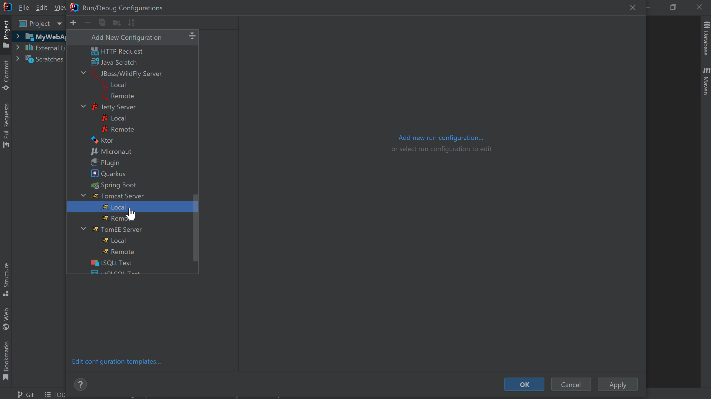

If you’re not creating a new project from scratch and instead have an existing project that runs on Tomcat, you can configure IntelliJ IDEA Ultimate to connect to your existing Tomcat installation. Let's work with [this application](https://github.com/helenjoscott/MyWebApp) from GitHub:

1. Clone the Project in IntelliJ IDEA and then go to **Run >  Edit Configurations**.
2. Select the **+** button and then **Tomcat Server > Local** (because we are running our Apache Tomcat server on our machine) from the drop-down:

3. Give the configuration a name such as `tomcat` and then click **Configure** next to the Application Server drop-down.
4. Paste in the same path we used earlier to point to the location of Apache Tomcat on your machine and press **OK**.
5. Leave the remaining values as the default and click the **Deployment** tab at the top.
6. Click the **+** to add a new deployment artifact and select `Artifact`.
7. Select `MyWebApp:war exploded` because that will allow you to update the application code without redeploying or restarting the server.
8. Click **OK** to finish configuring the Run configuration.

You can run the application with **^R** (macOS), or **Shift+F10**  (Windows/Linux) and IntelliJ IDEA will open our browser at the application’s root context which in this case displays an actual page because this app has an `index.jsp` file.