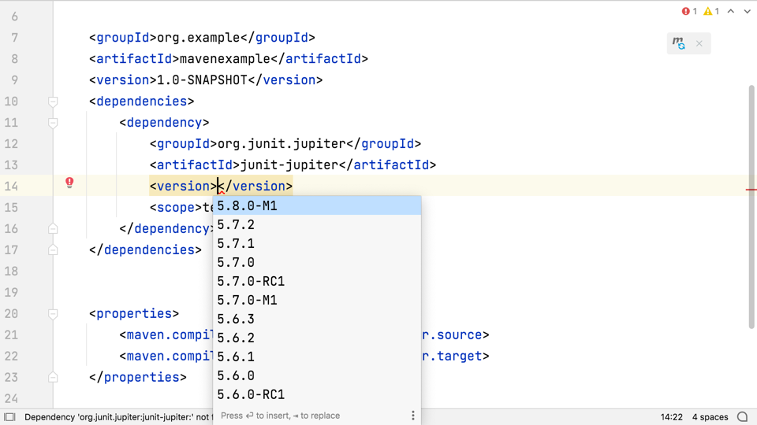

We can easily add new dependencies with the **Generate** option from the Code menu, or using **⌘N** (macOS), or **Alt+Insert** (Windows/Linux). 

This will bring up the artifact search dialog, which you can use to find the dependency you want.

---

**_Top Tip:_**
If you find you're not getting code completion for your libraries, or the results you expect in your Maven artifact search, there's a trick to help with that. Open the [Settings/Preferences dialog](https://www.jetbrains.com/help/idea/settings-preferences-dialog.html), go to
[Build, Execution, Deployment | Build Tools | Maven | Repositories](https://www.jetbrains.com/help/idea/maven-repositories.html).

You'll see IntelliJ IDEA has a list of indexed repositories, and the date it was last indexed. Selecting one, or all, of these and pressing **Update** usually helps IntelliJ IDEA to give good suggestions for artifacts.

---

As you'd expect from IntelliJ IDEA, you get code-completion inside your `pom.xml` file if you want to edit the XML directly. This not only lets you create valid XML (for example by automatically closing tags), but will also provide suggestions for dependencies.

You can see all your declared dependencies in the Maven window. Nested under those we've declared, you can see the dependencies they themselves rely on. 

When you look in the project window, you can see all the Maven dependencies, regardless of whether they're declared by your project or pulled in as a transitive dependency.

