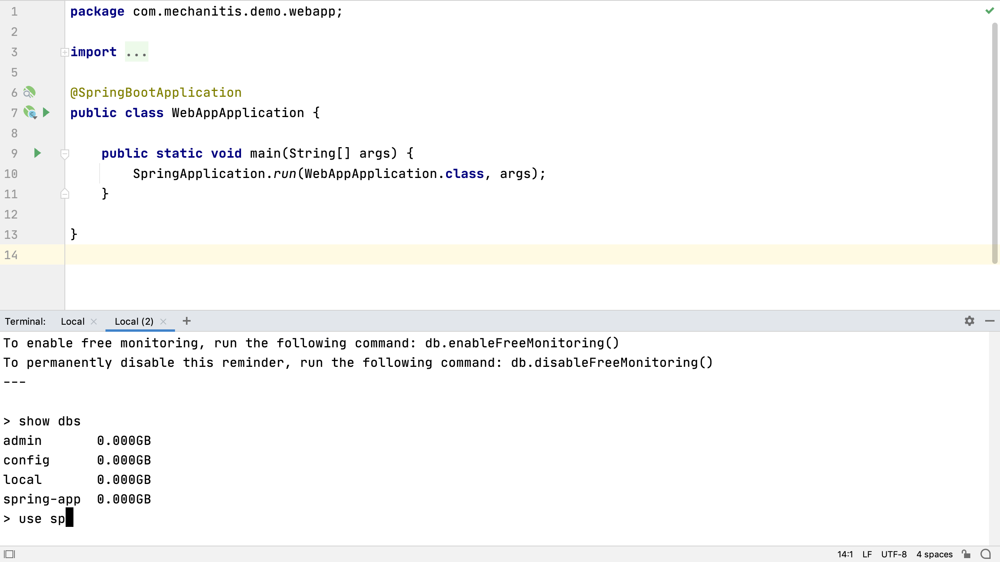
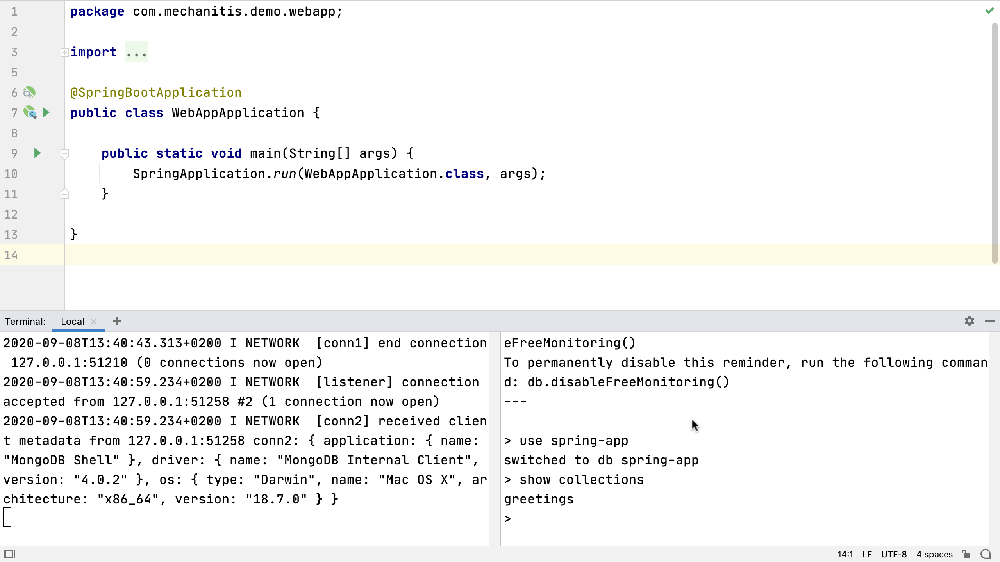

## Opening Multiple Terminal Sessions
We can [open a second terminal tab](https://www.jetbrains.com/help/idea/terminal-emulator.html#new_session) with **⌘T** on macOS, or **Ctrl+Shift+T** on Windows and Linux, to run the MongoDB shell as a new command:

`mongo`

Then we can interact with the server that’s running, and check everything is OK for our application.

Running commands in different tabs is helpful, but sometimes two different processes are closely related and we want to see them together. For this, we can [split](https://www.jetbrains.com/help/idea/using-code-editor.html#split_screen) our terminal window by right-clicking on it and selecting one of the options so that we can run two in the same window. For example, you can open up the mongo shell in this split window and can see if the commands have any impact on the running server.

---

