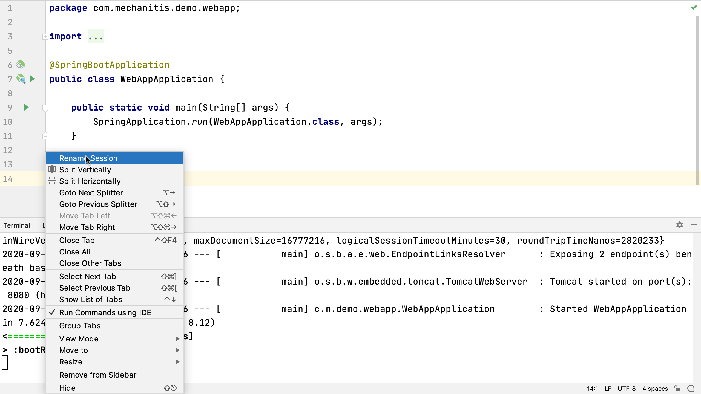

## Naming Your Terminal tabs
We can run any type of command from the terminal window. For example, although IntelliJ IDEA has full integration with Gradle, sometimes we might want to check a build tool like Gradle or Maven runs correctly from the command line. We might sometimes do this with different Java versions or different arguments to those we’re using in the application. Given that we might be using a number of terminal sessions with a number of different processes or parameters, it’s useful to rename the tabs to something helpful. You can do this from the context menu, which you can open by right-clicking on the tab. That way we can easily reopen the one we’re interested in.

We can [move between the different tabs](https://www.jetbrains.com/help/idea/terminal-emulator.html#new_session) with **⌘⇧** or **⌘⇧** on macOS or **Alt+←** or **Alt+→** on Windows and Linux. We can switch between the splits with **⌥⇥** on macOS, or **Ctrl+Tab** on Windows and Linux. We can close splits or tabs with **⌘W** on macOS, or **Ctrl+F4** for Windows and Linux.

When we restart IntelliJ IDEA, our terminal session names and other settings will persist.

---

