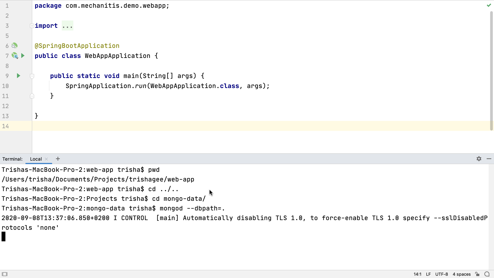

In this example we have a simple Spring Boot application that needs a running [MongoDB](https://www.mongodb.com/) database. We can [open the terminal window](https://www.jetbrains.com/help/idea/terminal-emulator.html#open-terminal) with **⌥F12** on macOS, or **Alt+F12** on Windows and Linux. The terminal supports all the same commands that the operating system supports.

If we want to start the MongoDB database instance with a [specific path for storing the data](https://docs.mongodb.com/manual/tutorial/manage-mongodb-processes/#specify-a-data-directory), we can type:

`mongod --dbpath [path to data here]`

and press enter. When MongoDB is running in the terminal session, we can go back to writing the application code in the editor. By using the built-in terminal, we don’t have to switch between applications, and we can easily have all aspects of our development right in front of us in the same window.

---