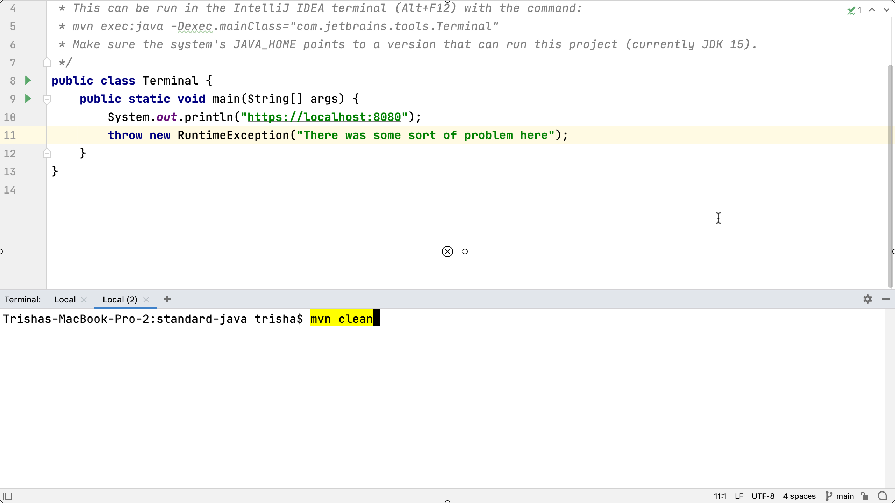

## Running Commands in the Terminal
You may notice that some commands in the terminal window are highlighted. This is a [feature in IntelliJ IDEA 2020.2](https://www.jetbrains.com/help/idea/terminal-emulator.html#smart-command-execution) that shows that the command could be run in the IDE, meaning we don’t need to use the command line.

If it’s highlighted in yellow and we press **Enter**, the command will be run in the terminal window just as we’d expect. If we type the same command again, but this time use **⌘⏎** on macOS, or **Ctrl+Enter** on Windows and Linux, IntelliJ IDEA will use the feature in IntelliJ IDEA and open the relevant tool window.

IntelliJ IDEA detects a number of different commands that could be run in the IDE instead of from the command line. For example, the git command:

`git log`

will execute normally if we press **Enter**. If we press **⌘⏎** on macOS, or **Ctrl+Enter** on Windows and Linux, it opens the [Git log window](https://www.jetbrains.com/help/idea/log-tab.html) in IntelliJ IDEA.

This is a great way to discover features in the IDE that are an alternative approach to using the command line. If we decide we’re not going to need these suggestions, we can turn off "Run IDE Features from the Terminal" from the terminal window’s settings using the context menu. The commands will no longer be highlighted.

---