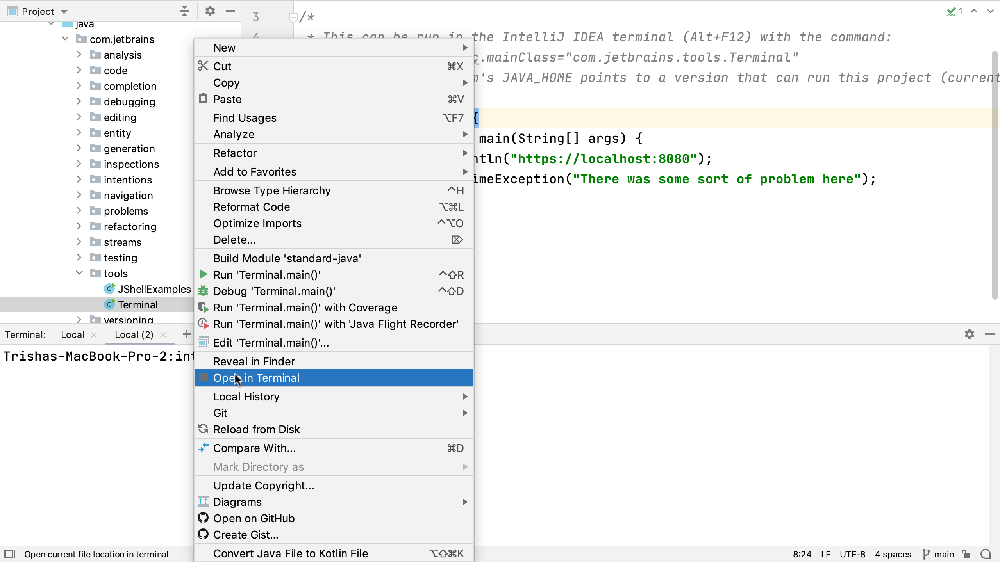

##Opening a Project Location in the Terminal
The integration provided by the IDE also extends to being able to [open a location from inside the project window](https://www.jetbrains.com/help/idea/terminal-emulator.html#open-terminal) in the terminal window from the context menu. Right click on an item in the Project Window, for example, and select "Open in Terminal". This means that we can have a terminal window in the correct location immediately without having to navigate using the command line.

---