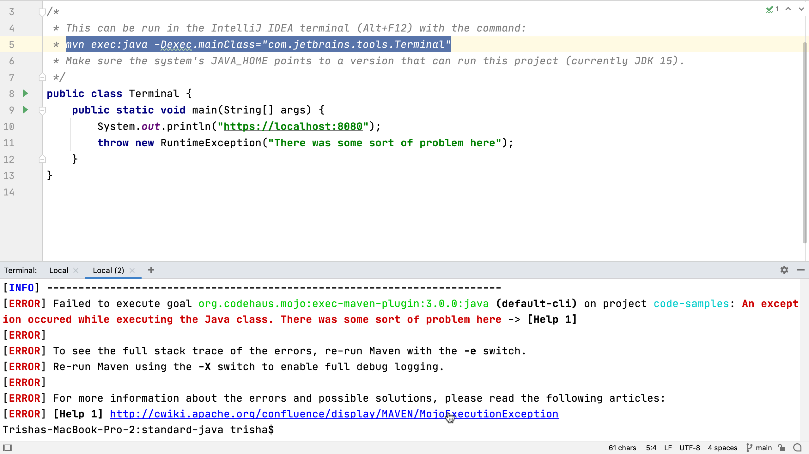

URLs in the terminal window are clickable, so we can click on any link shown in the terminal window to open them in the browser. File names in the terminal can also link back to the file in the project. In stack traces, you can click on the file name and IntelliJ IDEA will open the file and put the caret on the line that caused the problem. This takes some of the pain out of debugging problems.

---