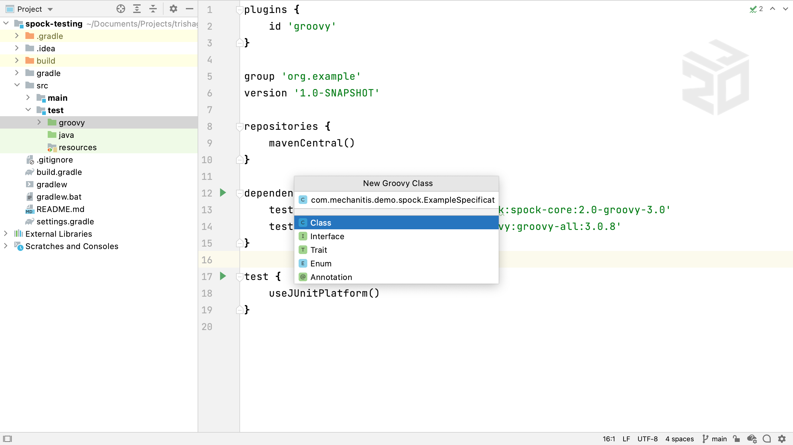
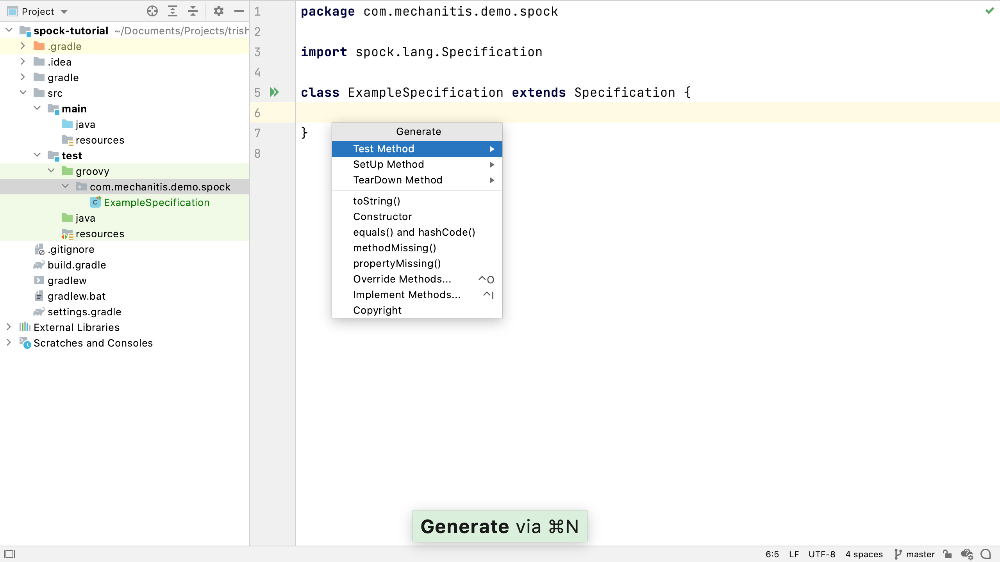
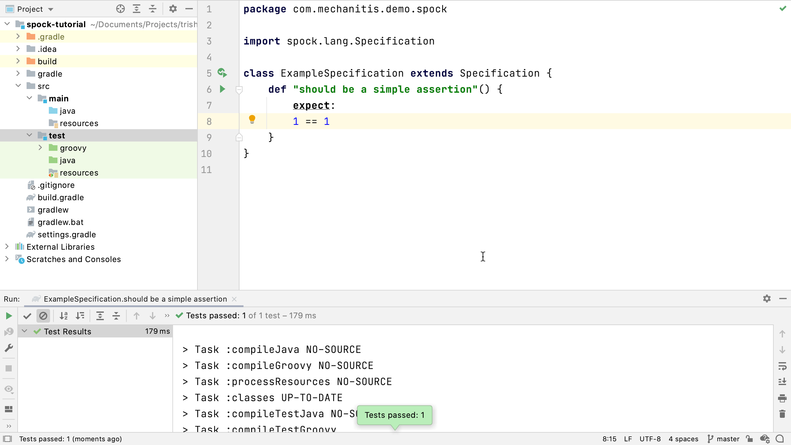
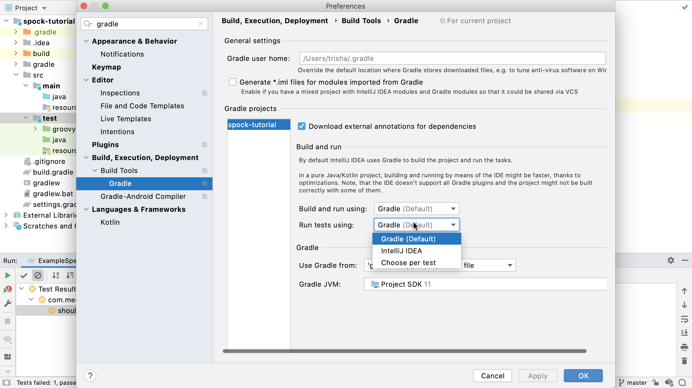

Let's start by writing a very simple test, so we can see what Spock tests look like.

From the [Project window](https://www.jetbrains.com/help/idea/project-tool-window.html), we can use the shortcut  **⌘N** (macOS) or **Alt+Insert** (Windows/Linux) to create a new file. Let's create a Groovy class, since Spock tests are Groovy classes:


Create the package and directory structure by typing the full package name before the class name.



Spock tests are often called Specifications, so call the test `ExampleSpecification`, put it into whichever package makes sense for you. Make sure this class extends Spock's [Specification](http://spockframework.org/spock/docs/2.0/all_in_one.html#_specification) class. 

```groovy
import spock.lang.Specification

class ExampleSpecification extends Specification {


}

```
We can get IntelliJ IDEA to generate test methods for Spock specifications using  **⌘N** (macOS) or **Alt+Insert** (Windows/Linux) inside the class.



This can be especially useful when we're not so familiar with writing Spock or Groovy code, as IntelliJ IDEA will generate the basic structure that we need. The method is defined with the "def" keyword, and Spock's method names can be Strings. This is extremely useful when we're creating tests, as the text format gives us a lot of flexibility for describing exactly what we are specifying the behaviour should be.

```groovy
class ExampleSpecification extends Specification {
    def "should be a simple assertion"() {

    }
}
```

Spock tests don't use an annotation or a specific test method name format to define which methods are tests. Instead, they use labels. We'll see the different types of labels available to use throughout the tutorial, for this simplest test we're going to use `expect`. This can be used for defining the simplest behaviour we expect to see.

```groovy
def "should be a simple assertion"() {
    expect:
    1 == 1
}
```

Spock also doesn't use _Assertions_ or an _Assert_ keyword, at least not normally. Instead, you can use simple checks, like the double equals. The `should be a simple assertion` method specifies a simple expected behaviour - that the number 1 should be equal to 1. It's not a realistic test case, but it shows the basics of a Spock test.

Run this test using **⌃R** (macOS) or **Shift+F10** (Windows/Linux), or the green arrow in the gutter near the line numbers. This test should pass.



Now, change it so that it fails, it's always helpful to see a test fail first to make sure it's actually working and testing the right things. When a test fails, Spock displays a helpful error message which shows exactly what failed and why.

```
Condition not satisfied:

1 == 0
  |
  false
```

By default, IntelliJ IDEA uses Gradle to run tests if it's a Gradle project. This is normally what we want, as it means our IDE is using the same process to run tests as the continuous integration or build environment is using. In a simple project like this one, where the Gradle build isn't doing anything extra like generating code or resources, it can be faster to use the IntelliJ IDEA test runner. We can [find this in the preferences](https://www.jetbrains.com/help/idea/gradle-settings.html) under Build, Execution, Deployment > Gradle, and we can select IntelliJ IDEA to run the tests.



Fix this test and rerun it to make sure it passes. You should see it's not using Gradle to run it, there shouldn't be any Gradle output in the test results window.

Now you know how to create and run a simple Spock test. Next, we're going to look at how to write tests with Spock in more detail.

