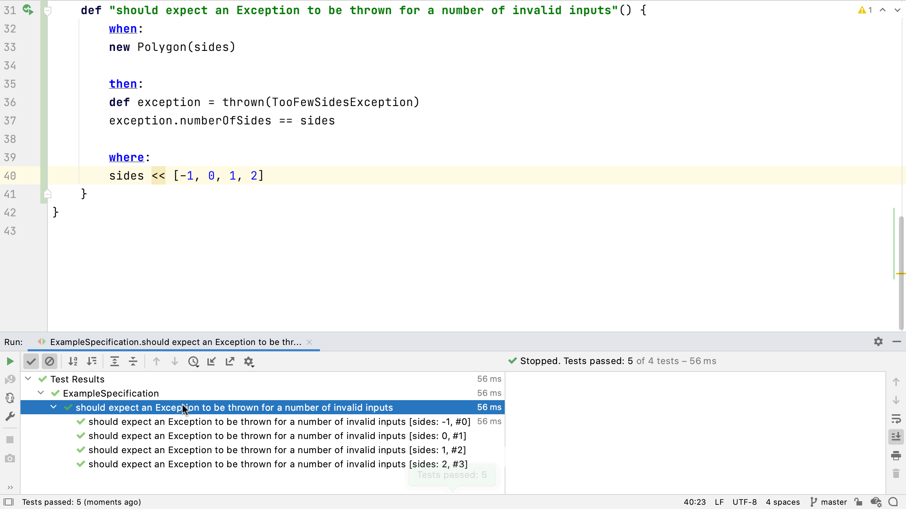
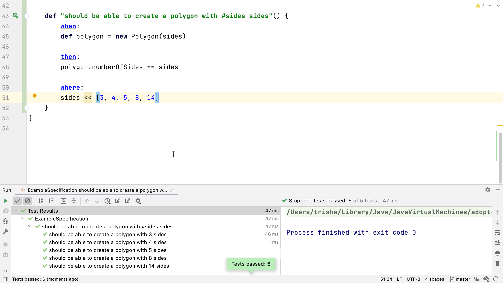

When we're testing a particular path, we sometimes want to check that a known set of values leads to the same result.

The exception test [we just wrote](https://blog.jetbrains.com/?p=109722/) is a good example - we know there's more than one input which should cause this exception to be thrown, and we might want to test all of them. In our case, any integer that is less than three should cause the exception. When you're using tests to document the expected behaviour, it's helpful to add the full list of values that can cause the Exception, or at least a sample list that demonstrates our expectations. Create a new test method that uses [Data Pipes](http://spockframework.org/spock/docs/1.3/all_in_one.html#_data_pipes) to do this:

```groovy
def "should expect an Exception to be thrown for a number of invalid inputs"() {
    when:
    new Polygon(sides)

    then:
    def exception = thrown(TooFewSidesException)
    exception.numberOfSides == sides

    where:
    sides << [-1, 0, 1, 2]
}
```

Note the new label at the end, `where`, which specifies the input values to the test. This test runs multiple times with different values passed into the constructor. So instead of passing in zero, it passes in a variable `sides`. The assertion also needs to check the `numberOfSides` on the exception matches the same number that we passed into the constructor.

The variable `sides` is defined in the where `block`. This uses the left-shift operator (`<<`) to give a list of values that we want `sides` to be.

```groovy
where:
sides << [-1, 0, 1, 2]
```

There are a couple of Groovy things to note here:

- Firstly, Groovy supports [operator overloading](https://groovy-lang.org/operators.html#Operator-Overloading), so the left-shift operator (`<<`) here means "this is the pipeline of values to use in the test";
- Secondly, Groovy has a [friendly syntax for creating lists of values](http://docs.groovy-lang.org/latest/html/documentation/working-with-collections.html#_list_literals), which is to simply put the values between square brackets.

The `where` block says "run this test with each of the following values: a negative value, zero, one and two".

Run this test to see what happens.



The test is effectively run four different times, the whole test is run once per value in that list for `sides`. IntelliJ IDEA shows the name of the test, then underneath that the test name plus the value of `sides` for each of the four values. All four of these runs passed, because our code correctly throws the expected Exception for each of these values.

If we want, we can change the method name to make it easier to understand what's being tested. We can use [hash and the name of a data variable in the method name](http://spockframework.org/spock/docs/1.3/all_in_one.html#_method_unrolling) to create a true description.

```groovy
def "should expect an Exception to be thrown for invalid input: #sides"() {
```

Re-run this, and IntelliJ IDEA will show this updated method name with the value of "sides", and no extra noise.


(Note: this is the behaviour in the latest versions of Spock. If you don't see this behaviour, you may need to use the [@Unroll](http://spockframework.org/spock/docs/1.3/all_in_one.html#_method_unrolling) annotation on your method).

Let's look at what happens if one of these values causes the test to fail. We know this exception should be thrown for a number of sides that's two or fewer so let's change one value to three.

```groovy
def "should expect an Exception to be thrown for invalid input: #sides"() {
    when:
    new Polygon(sides)

    then:
    def exception = thrown(TooFewSidesException)
    exception.numberOfSides == sides

    where:
    sides << [-1, 0, 3, 2]
}
```

Run the test to see one of the great things about data driven testing - all the tests are run even if one of the tests fails.


So we can see clearly which cases pass and which fail. If one of them fails, we can see what caused the problem. In our case, the test was expecting an Exception to be thrown and it wasn't. Go back and fix the test by replacing the `3` with a `1`.

Data pipes aren't just for testing exceptional cases. We might want to use them to test a series of valid inputs.

Create another test:

```groovy
def "should be able to create a polygon with #sides sides"() {
    when:
    def polygon = new Polygon(sides)
    
    then:
    polygon.numberOfSides == sides

    where:
    sides << [3, 4, 5, 8, 14]
}
```

Once again the test creates a polygon with a specified number of sides. Then it checks that the number of sides is the expected value. The `sides` variable is set up with a whole list of valid values. Running this test shows something similar to the previous test - a passing test for each of the values for `sides`.



This test is quite a simple one, and we can reduce the amount of code and do the same thing. We can inline the creation of the Polygon (by pressing **⌘⌥N** (macOS), or **Ctrl+Alt+N** (Windows/Linux) on the `polygon` variable name), so the constructor is called in the same line as the assertion. If we just have one statement which is setup, test, and assertion, we can use the `expect` label like we did in our very first simple assertion test. Of course, we still need the `where` block as this sets all the expected values for number of sides.

```groovy
def "should be able to create a polygon with #sides sides"() {
    expect:
    new Polygon(sides).numberOfSides == sides

    where:
    sides << [3, 4, 5, 8, 14]
}
```

Now we've seen how to write Spock tests that use data pipes to input lots of different values to a test. This means we can test and document the expected behaviour of the code under many conditions. 

Next, we'll look at data tables, another mechanism to do the same thing.