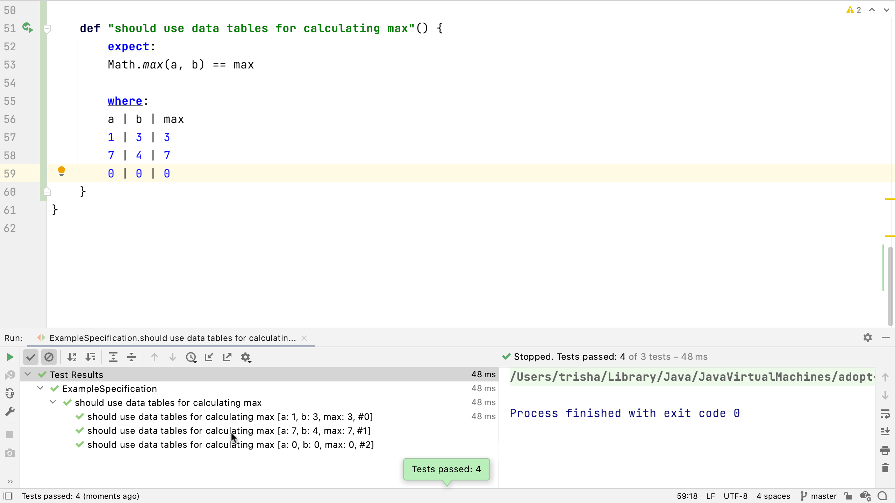
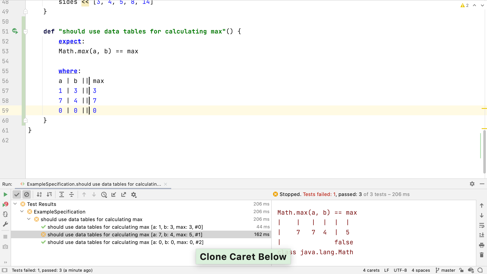

Data pipes are a nice way to specify a limited set of data to test. Spock also supports [Data Tables](http://spockframework.org/spock/docs/2.0/all_in_one.html#data-tables) for more complex data driven testing.

As we've seen, it's not unusual to want to pass in a series of values to check the same condition applies to all of them. Often we may have multiple inputs, and want to check them against multiple outputs. Let's say we want to check the calculation of something like the maximum of two values, `a` and `b`. We'll want to check that the return is the expected maximum value (this is the [same example as the documentation](http://spockframework.org/spock/docs/2.0/all_in_one.html#data-tables)).

```groovy
    def "should use data tables for calculating max"() {
        expect:
        Math.max(a, b) == max

        where:
        a | b | max
        1 | 3 | 3
        7 | 4 | 7
        0 | 0 | 0
    }
```

We use the `where` label again to define the inputs to the test. This time it's set out as a table of values. The first line is the header, the names of the variables we're going to use in the test separated by a pipe. Then we add a line for each set of inputs to the test.

Run this test to see something similar to the data pipes tests.



There's a passing "test" for each of the rows in the data table, described with the method name and the values for each of the input variables. If we make one of these fail we'll see all the cases are run and one of them fails.


Spock's [power assertions](http://spockframework.org/spock/docs/2.0/all_in_one.html#_assertions_with_explicit_messages_now_include_power_assertions_output) show the results of calculations, all the input values, and the comparison that failed. We can use this to fix the problem.

``` 
Condition not satisfied:

Math.max(a, b) == max
|    |   |  |  |  |
|    7   7  4  |  5
|              false
class java.lang.Math
```

We can make these data tables more readable by creating a separator between input and output columns. Try using IntelliJ IDEA's [clone caret](https://www.jetbrains.com/help/idea/pro-tips.html#multiple-selections) feature - put the caret next to the `|` between `b` and `max` and press **⌥** (macOS) or **Ctrl** (Windows/Linux) twice, keeping it held down on the second press, and pressing the down arrow to create a second caret underneath the first - do this until you have four carets, one for each line. Now if we type a second pipe, it appears on all the lines.



This pipe doesn't change the meaning of the test, it simply helps us to understand the table better. In our case, we've grouped the expected output on one side, and the inputs on the other. Run the test to make sure it works as expected.

As before, we can make the test a bit clearer by adding the names of the data variables into the test name. Now when we look at the test run, it's really clear what's being tested and what the expected result is.

```groovy
def "should use data tables for calculating max. Max of #a and #b is #max"() {
    expect:
    Math.max(a, b) == max

    where:
    a | b || max
    1 | 3 || 3
    7 | 4 || 7
    0 | 0 || 0
}
```

Now you know how to design data tables to create more complex sets of input and output data. Next, let's look at Spock's built-in mocking.

