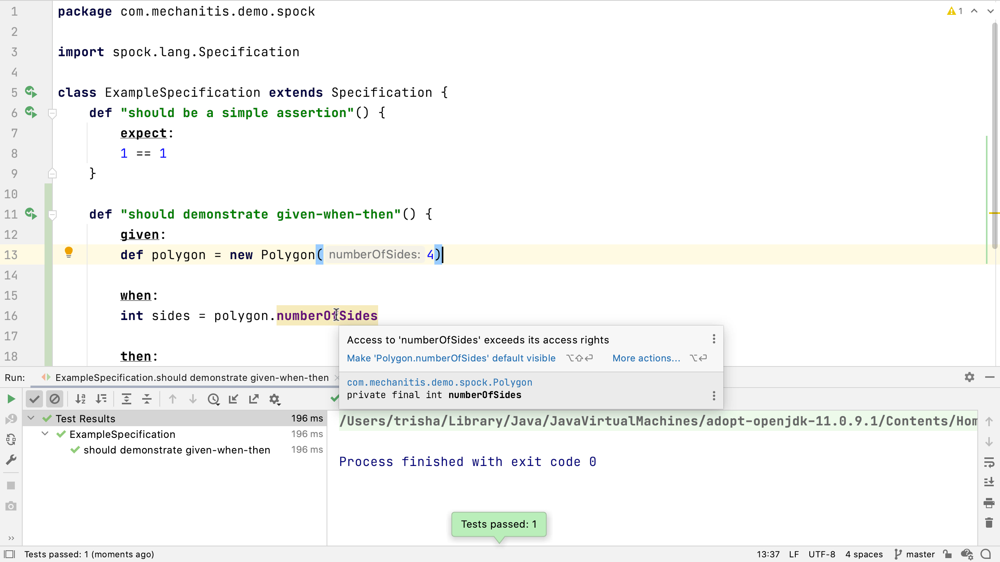
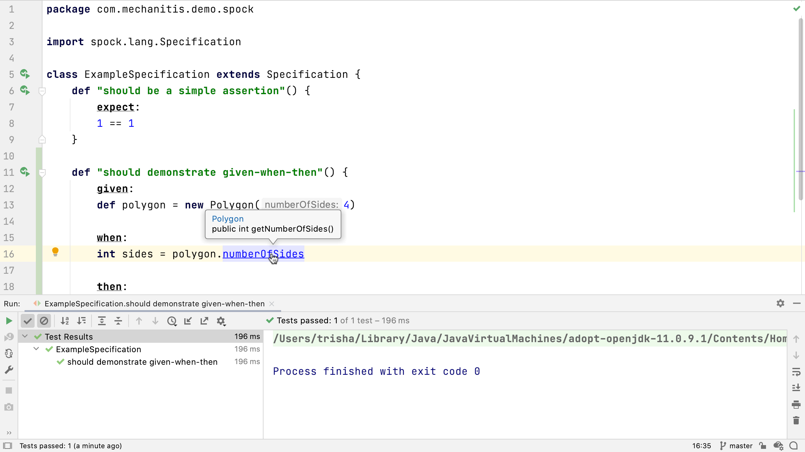

Before going further with Spock examples, let's take a look at some things which might look odd if we're used to using [Java](../../../technologies/java) to test Java code.

```groovy
when:
int sides = polygon.numberOfSides
```

In the `when` section of the test in the last example, we're actually reaching right inside the Java class to inspect the value of a private field. We can do this from Groovy, which can be helpful for testing private fields or methods, without compromising their visibility in production code. However, IntelliJ IDEA will give us a warning in case this is not something we want to do intentionally.



Often, if we need something visible for testing we probably will need it visible in production code too.

Go into your Polygon class and press **⌥⏎** (macOS), or **Alt+Enter** (Windows/Linux) on the field and get IntelliJ IDEA to create a getter for the field.


Look at the test now you've made this change to the Polygon class. Now there's something odd about the `polygon.numberOfSides` call. The warning has gone, and `numberOfSides` is no longer in bold, it no longer looks like it's referencing a field. In fact, it's not. If we hold down **⌘**, or **Ctrl**, and move our mouse over this, we can see it's actually referencing the method `getNumberOfSides`.



If we're calling a Java getter from Groovy code, we can miss out the "get" at the start of the method name, and Groovy will still use the getter rather than the field. This can be useful to reduce noise, but you can still use the full method name with "get" if you prefer, it depends upon what you think is most readable. Sometimes removing the "get" might be confusing.

In this section, we covered some tips on using Groovy to write tests. Now you know how to read Groovy code and understand that it may behave differently to how a Java developer would expect.

Next, we're going to go back to our tests and explore the labels in our tests a bit more. 

