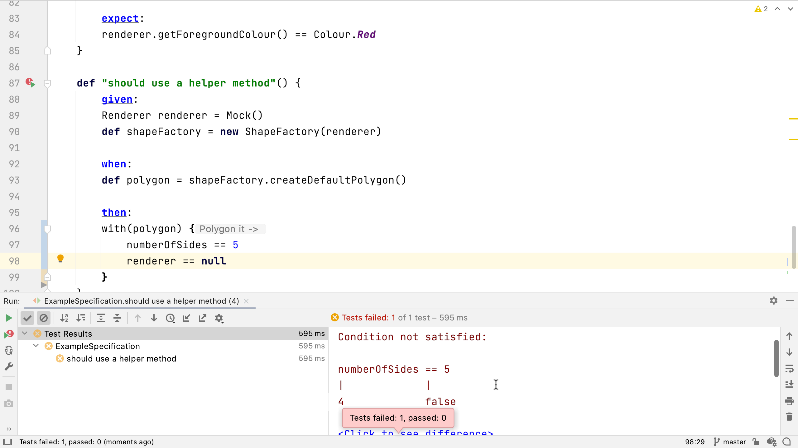

Let's look at one approach to testing multiple properties of a single object. We can change the previous test to the following:

```groovy
 def "should use a helper method"() {
    given:
    Renderer mockRenderer = Mock()
    def shapeFactory = new ShapeFactory(mockRenderer)

    when:
    def polygon = shapeFactory.createDefaultPolygon()

    then:
    with(polygon) {
        numberOfSides == 4
        renderer == null
    }
}
```
We can use Spock's [with()](http://spockframework.org/spock/docs/1.3/all_in_one.html#_using_code_with_code_for_expectations) and a closure to check multiple values on the `polygon`. Inside this closure, we don't have to say `polygon.`, we just assert the property matches the expected value.

Note that in this test the mock Renderer created in the `given` block is called `mockRenderer` - this is so that it's clear that the `renderer` in the `with` block is `polygon.renderer`, not the renderer from the test scope.

Change the test so it fails, so we can see what this looks like:



As with the helper method, if the first assertion fails, it doesn't run any further assertions. This might be what you want from your test, if one value is wrong the whole test should fail regardless. However, sometimes we want to run all the assertions, so we can see exactly what's working and what's not.

Now we have a simple mechanism for checking all the values of an object. However, sometimes we want to do multiple checks and make sure they all pass (or find out which fail), rather than failing at the first error. In the next section, we look at how to do that.