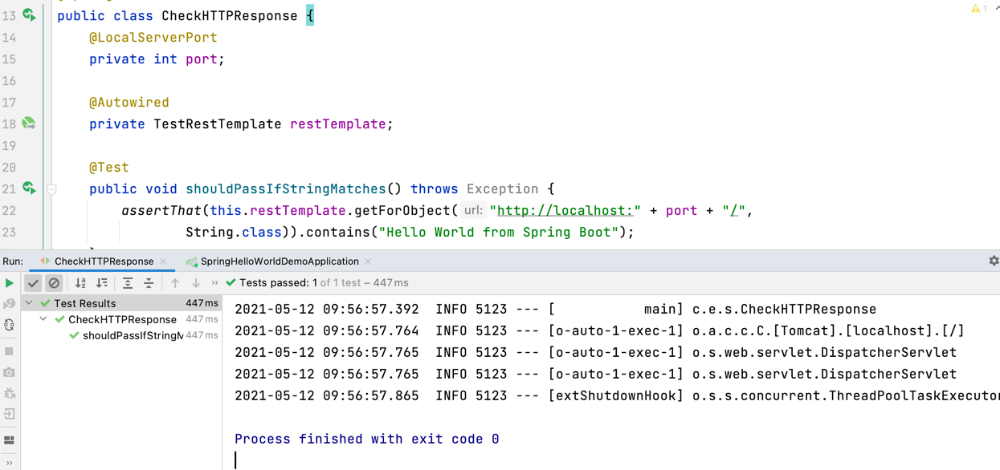

## Creating a Test for your Spring Boot Application
Let's write a test to check that in the event of an HTTP request, we get the response that we are expecting, in this case the string _Greetings from Spring Boot_.

Tests for Spring Boot are written using the standard [JUnit5 Testing Library](https://junit.org/junit5/docs/current/user-guide/).

1) We need to create a new Test class in the same place as our ```SpringHelloWorldDemoApplicationTest.java```, we will call ours ```SpringHelloWorldCheckHTTPResponse.java```.
2) Paste the following code into your test class:
```java
@SpringBootTest(webEnvironment = WebEnvironment.RANDOM_PORT)
public class SpringHelloWorldCheckHTTPResponse {
    @LocalServerPort
    private int port;

    @Autowired
    private TestRestTemplate restTemplate;

    @Test
    public void shouldPassIfStringMatches() throws Exception {
        assertThat(this.restTemplate.getForObject("http://localhost:" + port + "/",
                String.class)).contains("Hello World from Spring Boot");
    }
}
```
There's quite a lot going on here, but the most important things to draw your attention is that this line @SpringBootTest(webEnvironment = WebEnvironment.RANDOM_PORT)` starts a server with a random port which helps to avoid testing conflicts. 

We get a TestRestTemplate for free with Spring. The `@Autowired` annotation tells Spring that we want to use that (that really is all we have to do to use it). 

Finally, our test itself, which is annotated with the `@Test` annotation will pass when our assertion is correct. Our assert statement is comparing the string we are serving on our local port with the string in the second half of the assert statement - _Hello world from Spring Boot_.

3) Let's run the test to check it works. You can run it again with **Ctrl**+**R** (macOS), or **Shift**+**F10** (Windows/Linux). We should see that our test is green. 
   


It's always worth checking our assumptions, so try changing the text to something other than _Hello World from Spring Boot_ and check that the test fails. It should do!

In the next step we will summarise what we've done up to this point and list the resources we've used. 