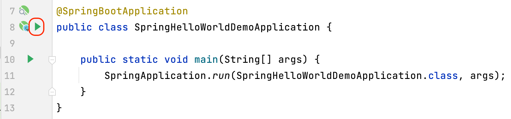

## Project Walk-through
In the previous step we asked IntelliJ IDEA to create us a Spring Boot project with **Spring Web** as a dependency. Let's now take a look at what has been automatically created, so that we can build on that understanding in the next step.

Let's take a look around some aspects of the project. The easiest way to do this is from the Project tool window which you can access with **⌘1** on macOS, or **Ctrl**+**1** on Windows and Linux. We will look at:

- The .mvn folder
- SpringHelloWorldDemoApplication.java
- SpringHelloWorldDemoApplicationTests.java
- The pom.xml file

### The .mvn Folder
This folder has been created because Spring Boot uses the Maven wrapper when you create a Spring Boot project with the Maven build system. This means you don't have to install Maven locally to run your Spring Boot project. You should commit this project to version control, but you can ignore it from now on.

### The SpringHelloWorldDemoApplication.java File
Inside your **main** > **java** > **com.example.springhelloworlddemo** file structure you'll see your ```SpringHelloWorldDemoApplication.java``` file. Let's take a look in more detail.

This is what your Java file will look like. The name will be whatever your called the file with _Application_ appended to it. 

```java
package com.example.springhelloworlddemo;

import org.springframework.boot.SpringApplication;
import org.springframework.boot.autoconfigure.SpringBootApplication;

@SpringBootApplication
public class SpringHelloWorldDemoApplication {

    public static void main(String[] args) {
        SpringApplication.run(SpringHelloWorldDemoApplication.class, args);
    }
} 
```

We've got our package at the top of the class as you'd expect followed by our import statements. It's work noting that the first import is Spring itself, the second import is Spring Boot. 

#### Main Body of Our Class
The `@SpringBootApplication` annotation at the class level creates an ApplicationContext which is the container that is used for inversion of control in Spring applications. Instead of you managing the objects, the ApplicationContext does that for you. As part of that functionality, the ApplicationContext creates a Tomcat server for you (which will become important later).

This Spring Boot annotation also pulls in a lot of core Spring dependencies that your project needs. While you don't need to necessarily know them all, you do need to know that this is happening, especially when it comes to solving errant behaviour in your code. 

The main line here is:
`SpringApplication.run(SpringHelloWorldDemoApplication.class, args);`

This makes a call to Spring Boot's `run` method, and we need to pass the main class of our project to Spring, in this case, it's the same class. 

### The SpringHelloWorldDemoApplicationTests.java File
If you head down to the **test** > **java** > **com.example.springhelloworlddemo** folder you'll see you have another class called ```SpringHelloWorldDemoApplicationTests.java```. This is a test you get for free with Spring Boot.  It checks if the Application Context can start, it will fail if not. The test can be a useful starting point for creating your own integration tests.

### The Maven pom.xml File
This file is generated with the dependencies that you selected when we created this project. 

```java
<dependencies>
        <dependency>
            <groupId>org.springframework.boot</groupId>
            <artifactId>spring-boot-starter-web</artifactId>
        </dependency>

        <dependency>
            <groupId>org.springframework.boot</groupId>
            <artifactId>spring-boot-starter-test</artifactId>
            <scope>test</scope>
        </dependency>
    </dependencies>
```
The first dependency on ```spring-boot-starter-web``` is there because we selected **Spring Web** as a dependency. The second dependency on ```spring-boot-starter-test``` is something you get with any Spring application. It gives you the ability to create tests with various testing libraries.

It's very easy to add dependencies to your ```pom.xml``` file once you have created your Project. Use **⌘N** (macOS), or **Alt+Ins** (Windows/Linux) and then browse for your dependency. However, for our demo, these are the only dependencies that we need. 

## Running our Spring Application
We have the basics of our Spring Application at this point. You can run it with **Ctrl**+**R** (macOS), or **Shift**+**F10** (Windows/Linux). Alternatively you can use the gutter icons:



The application will run and start the Tomcat webserver. You can verify it's working by going to your web browser and typing ```localhost:8080```. Port 8080 is the default port for Tomcat. 

You should get a 404 response which will look similar to this:


This means that the Spring application is working, but it has nothing to serve. We will fix that in the next step! Before we do any more development it's a good idea to stop your server from running. You can do this with **⌘** (macOS), or **Ctrl**+**F2** on Windows and Linux. 