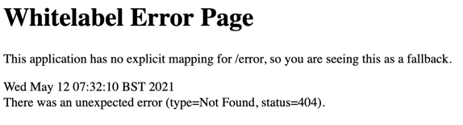

## Project Walk-through
In the previous step we asked IntelliJ IDEA to create us a Spring project with **Spring Web** as a dependency. Let's now take a look at what has been automatically created, so that we can build on that understanding in the next step.

Let's take a look around some aspects of the project. The easiest way to do this is from the Project tool window which you can access with **⌘1** on macOS, or **Ctrl**+**1** on Windows and Linux. We will look at:

- The .mvn folder
- SpringHelloWorldDemoApplication.java
- SpringHelloWorldDemoApplicationTests.java
- The pom.xml file

### The .mvn Folder
The next folder we can see is _.mvn_. This is not a surprise since we selected Maven for our build system when we created the project, but when you open it you'll see that it has Maven Wrapper files inside it. That's because Spring Boot projects come with everything bundled and specific versions of those things meaning you can run your project without installing Maven. Of course, IntelliJ IDEA makes creating a project with Maven as your build system easy, but Spring Boot doesn't know that, so it opts to keep everything coupled together which is why the project comes with the Maven Wrapper instead of Maven.

### The SpringHelloWorldDemoApplication.java File
Inside your **main** > **java** > **com.example.springhelloworlddemo** file structure you'll see your ```SpringHelloWorldDemoApplication.java``` file. Let's take a look in more detail.

This is what your Java file will look like. The name will be whatever your called the file with _Application_ appended to it. 

```java
package com.example.springhelloworlddemo;

import org.springframework.boot.SpringApplication;
import org.springframework.boot.autoconfigure.SpringBootApplication;

@SpringBootApplication
public class SpringHelloWorldDemoApplication {

    public static void main(String[] args) {
        SpringApplication.run(SpringHelloWorldDemoApplication.class, args);
    }
} 
```

We've got our package at the top of the class as you'd expect. Next, we have two important imports.

#### Import Statements
The first import, ```import org.springframework.boot.autoconfigure.SpringApplication``` allows the application to be bootstrapped and launched from a Java _main_ method.

This annotation also creates an ApplicationContext which is the container that is used for inversion of control in Spring applications. Instead of you managing the objects, the Application Context does that for you. As part of that functionality, the Application Context creates a Tomcat server for you (which will become important later).

Finally, Spring Beans are the objects that the Application Context manages for you.   
The @SpringApplication also means you can run the application from the main method, standalone. 

The second import, ```org.springframework.boot.SpringBootApplication``` does more than it appears at first glance. Spring pulls in a lot of dependencies behind the scenes and while you don't need to necessarily know them all, you do need to know that this is happening, especially when it comes to solving errant behaviour in your code. Using this import also gives you the following annotations:

Definitions from [https://spring.io/guides/gs/spring-boot/](https://spring.io/guides/gs/spring-boot/).

```java
import org.springframework.context.annotation.Configuration;
```

@Configuration: Tags the class as a source of bean definitions for the application context.

```java
import org.springframework.context.annotation.ComponentScan;
```

@ComponentScan: Tells Spring to look for other components, configurations, and services in the com/example package, letting it find the controllers.

```java
import org.springframework.boot.autoconfigure.EnableAutoConfiguration;
```

@EnableAutoConfiguration: Tells Spring Boot to start adding beans based on classpath settings, other beans, and various property settings. For example, if spring-webmvc is on the classpath, this annotation flags the application as a web application and activates key behaviors, such as setting up a DispatcherServlet.

#### Class Body
The most interesting line here is of course inside Java's main method:

```SpringApplication.run(SpringHelloWorldDemoApplication.class, args);```

This makes a call to Spring Boot's ```run``` method which creates an object of ConfigurableApplicationContext. This is then used to run the Spring Boot application.

### The SpringHelloWorldDemoApplicationTests.java File
If you head down to the **test** > **java** > **com.example.springhelloworlddemo** folder you'll see you have another class called ```SpringHelloWorldDemoApplicationTests.java```. This is a test you get for free with Spring Boot.  It checks if the Application Context can start, it will fail if not.

### The pom.xml File
This file is generated with the dependencies that you selected when we created this project. 

```java
<dependencies>
        <dependency>
            <groupId>org.springframework.boot</groupId>
            <artifactId>spring-boot-starter-web</artifactId>
        </dependency>

        <dependency>
            <groupId>org.springframework.boot</groupId>
            <artifactId>spring-boot-starter-test</artifactId>
            <scope>test</scope>
        </dependency>
    </dependencies>
```
The first dependency on ```spring-boot-starter-web``` is there because we selected **Spring Web** as a dependency. The second dependency on ```spring-boot-starter-test``` is something you get with any Spring application. It gives you the ability to create tests with various testing libraries.

It's very easy to add dependencies to your ```pom.xml``` file once you have created your Project. Use **⌘N** (macOS), or **Alt+Ins** (Windows/Linux) and then browse for your dependency. However, for our demo, these are the only dependencies that we need. 

## Running our Spring Application
We have the basics of our Spring Application at this point. You can run it with **Ctrl**+**R** (macOS), or **Shift**+**F10** (Windows/Linux). Alternatively you can use the gutter icons:


The application will run and start the Tomcat webserver. You can verify it's working by going to your web browser and typing ```localhost:8080```. Port 8080 is the default port for Tomcat. 

You should get a 404 response which will look similar to this:



This means that the Spring application is working, but it has nothing to serve. We will fix that in the next step! Before we do any more development it's a good idea to stop your server from running. You can do this with **⌘** (macOS), or **Ctrl**+**F2** on Windows and Linux. 