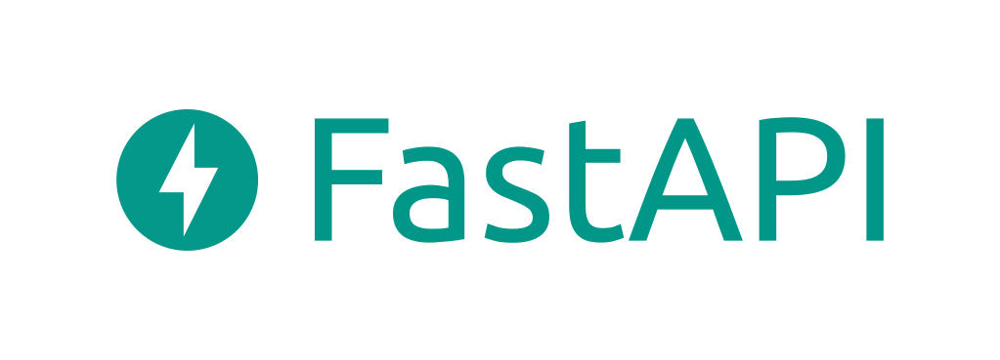

Hello everyone, welcome to the part one of the AWS Django tutorial series. 
Today I will be explaining in brief about Django Framework and 
different python frameworks available in the market.

# Background

Django was created in the fall of 2003, when the web programmers 
at the Lawrence Journal-World newspaper, Adrian Holovaty and Simon Willison,
began using Python to build applications. Jacob Kaplan-Moss was hired early
in Django's development shortly before Simon Willison's internship ended.
It was released publicly under a BSD license in July 2005. 
The framework was named after guitarist Django Reinhardt.
Adrian Holovaty is a Romani jazz guitar player and a big fan of 
Django Reinhardt.

In June 2008, it was announced that a newly formed 
**Django Software Foundation (DSF)** would maintain Django in the future.

Django started off with great documentation, the best of any other
open-source framework. And it’s still maintained on a high level, 
updated along with the new functions and fixes, so you can easily
adapt to changes.

To know more about Django, I recommend following official django docs [djangoproject.com](https://www.djangoproject.com/)

# Python Frameworks

Flask is a micro web framework written in Python. 
It is classified as a microframework because it does not require
particular tools or libraries. It has no database abstraction layer,
form validation, or any other components where pre-existing third-party
libraries provide common functions.

For reference, you can visit [flask.palletsprojects.com](https://flask.palletsprojects.com/)

FastAPI is a modern, fast (high-performance), web framework 
for building APIs with Python 3.6+ based on standard Python type hints.

The key features are:

- **Fast**: Very high performance, on par with NodeJS and Go (thanks to Starlette and Pydantic). One of the fastest Python frameworks available.

- **Fast to code**: Increase the speed to develop features by about 200% to 300%. *

- **Fewer bugs**: Reduce about 40% of human (developer) induced errors. *
- **Intuitive**: Great editor support. Completion everywhere. Less time debugging.
- **Easy**: Designed to be easy to use and learn. Less time reading docs.
- **Short**: Minimize code duplication. Multiple features from each parameter declaration. Fewer bugs.
- **Robust**: Get production-ready code. With automatic interactive documentation.
- **Standards-based**: Based on (and fully compatible with) the open standards for APIs: OpenAPI (previously known as Swagger) and JSON Schema.

For reference, you can visit [fastapi.tiangolo.com](https://fastapi.tiangolo.com/)

Pyramid is one of those web application frameworks that work with 
minimum complexity. This framework can accommodate applications of
any size and can be used to create complex applications when scaling
a small application. It specifies the location of a packaged asset and
makes use of predicates as well as renderers.

It also allows URL generation. The templating engine or database
of this framework can be mutually swapped out. It also has XHR views
and decorators with which you can send Ajax requests easily. It supports
the SQLAlchemy database.

For reference, you can visit [trypyramid.com](https://trypyramid.com/)

There is a huge list of python web frameworks available in the market.
In order to start working with web application using python,
you will require a web framework. While choosing a framework,
remember to consider the size and complexity of your application.
