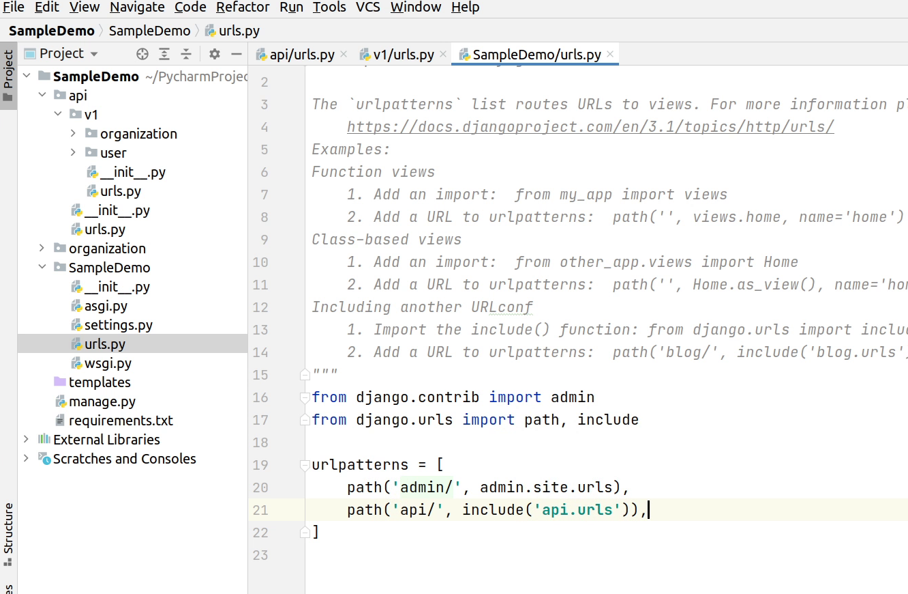
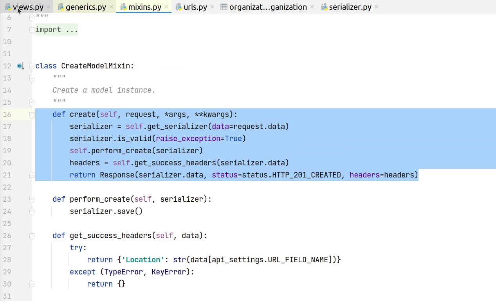

Hello everyone, welcome to the Django tutorial series. In this tutorial step,
we are going to write REST APIs with [Django Rest Framework](https://www.django-rest-framework.org/). 

It’s not like we can’t develop APIs with Django, but a lot of the heavy lifting is already taken care of by DRF, such as: access control, serialization/deserialization, JWT Authentication, Pagination, RateLimiting etc. We will explore how DRF makes our life easier.

I recommend that you to follow in parallel the video tutorial, for better hands-on learning. 

# DRF Setup

For our tutorial step, we will be using the **3.12.2** version. 

To install Django Rest Framework (DRF), run the below given command.

```
pip install djangorestframework==3.12.2
```


Make sure to add **rest_framework** in the **INSTALLED_APPS** of your **settings.py** file.


I am going to create a package in project root and name it as **api**. I 
normally break down my apis into different versions, and each version
contains its own business logic, routing etc. With this, I can also
maintain backward compatibility.

As you can see in the images below, I am going to modularize my folder structure.
You are free to use your own approach and play around with it.

Let's design our API routes to follow version semantics like **/api/v1/**:




There are four major files under **v1/organization**:


- **serializer.py** - According to DRF, serializers allow complex data such as querysets and model instances to be converted to native Python data types. These can then be easily rendered into JSON , XML or other content types.

- **urls.py** -  It's where you define the mapping between URLs and views. You can also consider them as routes.

- **validator.py** - We use this file to write our common validation code which can be later re-used.

- **views.py** - This is the file where we are going to write all our business logic.

 
Let us first start implementing our business logic in the views file.
We will be writing our first API that will perform two operations:
- Creating a new organization
- Listing all the organizations

I will be importing **ListCreateAPIView** from **rest_framework.generics**.

According to the Django documentation: <em>generic views were developed 
as a shortcut for common usage patterns... They take certain common idioms
and patterns found in view development and abstract them so that you can quickly
write common views of data without having to repeat yourself.</em>


There are several generic views provided by DRF. **ListCreateAPIView** is much
better than using the basic **APIView**. If you try writing the same logic
in APIView then you need to implement **get()** and **post()** methods. In the
case of the **ListCreateAPIView** the **get()** and **post()** method is 
already implemented. This is how Django makes your life easy by writing less code.


As you can see the image below, we are going to inherit ListCreateAPiView in our OrganizationAPI. The
mandatory attributes are **queryset** and **serializer_class**.


A **[QuerySet](https://docs.djangoproject.com/en/3.1/ref/models/querysets/)** represents a collection of objects from your database. For 
our case we are trying to get all the objects from the Organization model.

According to Django Rest Framework, [Serializers](https://www.django-rest-framework.org/api-guide/serializers/) allow complex data such as 
querysets and model instances to be converted to native Python data types
that can then be easily rendered into JSON, XML or other content types. Serializers 
also provide deserialization, allowing parsed data to be converted back into
complex types, after first validating the incoming data.

**For example** : When you pass a Javascript Object through an API 
it gets converted to native python dictionary.

You can see we are using [ModelSerializer](https://www.django-rest-framework.org/api-guide/serializers/#modelserializer). It provides a useful 
shortcut for creating serializers that deal with 
model instances and querysets. 


We will be using **____all____** in our fields attribute to display all fields
present in our model. It is strongly recommended that you explicitly set all 
fields that should be serialized using the fields attribute. This will make it
less likely to result in unintentionally exposing data when your models change.


Coming back to our business logic, I will be adding **permission_classes**.

[Permission](https://www.django-rest-framework.org/api-guide/permissions/) checks are always run at the very start of the view, 
before any other code is allowed to proceed. Permission checks will 
typically use the authentication information 
in the ```request.user``` and ```request.auth``` properties to 
determine if the incoming request should be permitted.

In our case we will be using **AllowAny**, basically anyone can access
my api without any authentication. In my upcoming tutorial I will be explaining
how to protect our APIs.


Let’s register our API in the **urls.py** file. 

You need to pass **[as_view()](https://docs.djangoproject.com/en/3.1/ref/class-based-views/base/#django.views.generic.base.View.as_view)** along with your 
view name if are using [class-based views](https://docs.djangoproject.com/en/3.1/topics/class-based-views/). This
provides a function-like entry into class based views.


Our URL route is now registered. Let’s begin by opening postman. [Postman](https://www.postman.com/) is
a popular API client that makes it easy for developers to create, share, 
test and document APIs. This is done by letting create and save simple
and complex HTTP/s requests, as well as read their responses. 


I am now going to provide the organization route and will be
performing a POST request to store organization information in our database.


If you don't provide any necessary information, 
the API is going to return response 400 Bad Request.

You can see the below image, it's saying **"This field is required"**. The error message and validation
is actually taken care by the serializer. This is one of the good points how serializers are doing the heavy work behind
the scenes. 

The three fields : 
- name 
- registration_code 
- established_on
  
The above fields are not null in our database table, so we require a mandatory value to be inserted. 
If any column has null set to true,
then it won’t appear because it has now become optional. All this is taken care of by the ModelSerializer.


Now, I am going to provide all the necessary information and after that I will click on **Send**.


Awesome! The data has been successfully stored in our database. As you can see, we received a
JSON response and in return the new row has been created with id of 1.


Let’s verify that record in our database.

You can see the below image, the record is successfully reflecting.


Let me try to send the same request again and check what happens. You can see we are receiving an
error: **organization with registration code already exists**. I know that I 
haven’t written this validation message: this is again taken care of by the serializer 
because **registration_code** is a unique field in our database. This is amazing how serializers
are performing validations based on our data model. We even have the
flexibility to write custom validators.


Let's now try to customize the response message. Instead of showing all the inserted objects, I 
also want to add a message flag.

Before going forward, first I will remove the record from the database.


You can see on my screen that ListCreateAPIView inherits **ListModelMixin**, **CreateModelMixin** and **GenericAPIView**. 


I will click on **CreateModelMixin**, under the hood it is actually creating a model instance.

I will override the **create** function by changing the response structure. Let me first copy
the function and paste it in the OrganizationAPI.




I will do the necessary imports which are required. Next, I will do a minor modification in our
response by adding three keys :
 - **status**
 - **message**
 - **data**


Let’s now test again in postman. You can see in the image below that we received a customized response
from our API. This is how you can play with the APIs by overriding the base implementation.


I will add one more sample record just to validate the API is working fine. 


As we are done with the POST method, let's move ahead with GET operation as we are using ListCreateAPIView which supports both post & get operations.

You can see in the below image, we are viewing both the records which got inserted in our database recently. 
Just imagine if you had used the vanilla APIView, then you had so much work needed to be done to accomplish this. 
As we are done with GET & POST let’s move on and focus on implementing PUT & DELETE operation.


I will be creating a new class which will inherit the generic view **RetrieveUpdateDestroyAPIView**. It is used for 
read,write and delete endpoints to represent a single model instance.

It supports **get**, **put**, **patch** and **delete** method handlers.

As you can see in **get_queryset** we are passing **“pk”** which is actually the primary key or ID column in the table 
which we are referring to. 


Next, I will register the API in urls. 


Let’s now test our endpoint in postman. As you can see, I am performing the same GET operation but with a
small difference: I am actually passing an integer which is actually referring to the primary key
or id in our table.


We got the information for the specific row in our table. ListAPI returns us all
the objects which retrieveAPI will give information for a specific object.

Now, I am going to perform a PUT operation to update my record. I will provide the information in the body, 
but I will provide a different value for the registration code.


As you can see the below image,  RetrieveUpdateDestroyAPIView uses three mixins : 
**RetrieveModelMixin**, **UpdateModelMixin**, **DestroyModelMixin** and **GenericAPIView**.


I am going to change the response structure for the PUT operation by 
before by overriding the **UpdateModelMixin**.


Okay! Pur record has been successfully updated, and you see the customized response. 


Let me verify that in our database.


Let’s complete the final operation by removing the record from our database by performing the DELETE operation.

I am going to remove the record for id number 3. 

We have successfully removed the record. We have received a **“204 No Content”** HTTP response. This is a default behaviour
in DELETE method that we don’t receive any json response in the body. Let me verify that in the database.


Yes, the record with id number 3 has been successfully removed.


This completes the cycle of performing Create, Read, Update & Delete operations in our APIs. There 
are many ways you can create APIs like using a function based approach, creating from 
scratch by using vanilla APIView or using viewsets. [Viewsets](https://www.django-rest-framework.org/api-guide/viewsets/) are
really amazing to try out, please check the official DRF documentation.

In the upcoming tutorial step, I am going to show you how to protect APIs by using JSON Web Tokens (JWT).