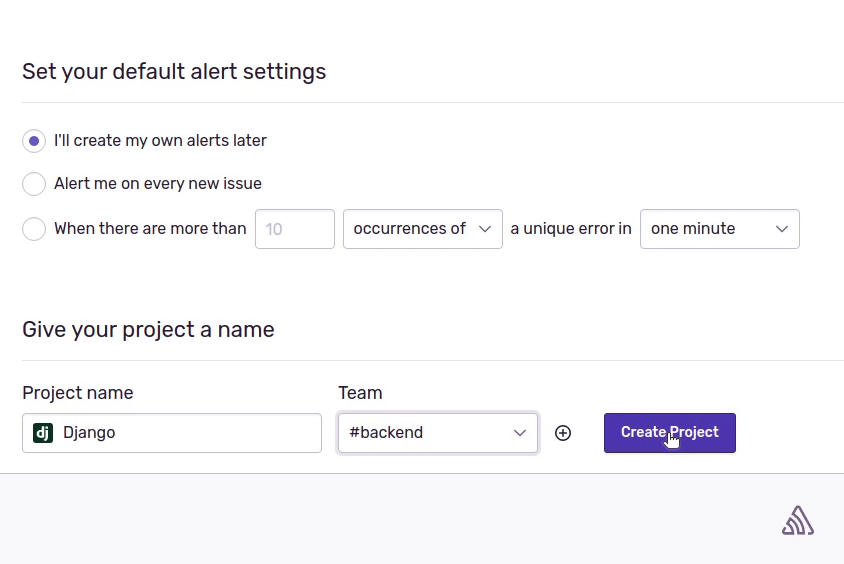

Hello everyone, welcome to the Django tutorial series. In this tutorial step, 
we are going to set up Sentry, an application for monitoring and error tracking.

Sentry automates exception handling for every programming language and platform, so you can observe and respond
to any issues up and down the stack: JavaScript, Python, PHP, Ruby, Java, and modern frontend frameworks 
and even the serverless frameworks.

To know more about Sentry please visit the website [sentry.io](https://sentry.io/)

# Project Setup

Make sure to create an account in Sentry, it's pretty straight forward. I already have an account,
so I will proceed with the login.

Ok, we have reached the dashboard, I will now click on **Create Project**.

I will choose **Django**, as my platform. 

For the default alert settings, I am not going to modify my choice. Leave
it as **“I’ll create my owner alerts later”**. You can come back anytime and modify it.

My project name will be **Django**, and it will fall under the team **backend**. You can assign developers
to a particular team, so they can access this project. Everything looks good, I will click on **Create Project**.

# Integrating Sentry with Django

The project has been successfully created. Next, we need to follow these instructions to configure
Sentry with Django. 
 

First, I will be installing the sentry sdk package. 

Next I will copy the configuration into my **settings.py** file.

When you deploy your application into production, make sure you pass the **dsn** value 
also known as **Data Source Name(DSN)** through the environment variable.

To set a uniform sample rate for all transactions, set the **traces_sample_rate** option in your SDK
config to a number between 0 and 1. (For example, to send 20% of transactions, 
set traces_sample_rate to 0.2

Sentry also excludes personally identifiable 
information (such as user ids, usernames, cookies, authorization headers, IP addresses) unless
you set **send_default_pii** to True.

Okay, we are all set, let's trigger some exceptions. According to the Sentry documentation, I will 
perform **ZeroDivisionError** in my application.

# Firing our first event

Currently, there are no events. Let’s initiate our first event.

I am going to add a **result** variable in line number 14, which will raise an **ZeroDivisionError** exception.

I will be calling my API and in the result, it will raise an exception, and the event will be passed to sentry.

Let me verify in Sentry whether we have received the new event. 

Yes, the error has logged in Sentry, and the best thing is, it’s displaying the entire traceback 
along-with the filename, and the line number where the exception was caught.

This is something you definitely need in your production workflow to 
smoothly track your code,  along with performance issues.

Before moving forward, make sure to revert code which is causing the exception. In the 
upcoming tutorial we will be focusing on unit tests to make sure 
our code works perfectly fine before deployment.

